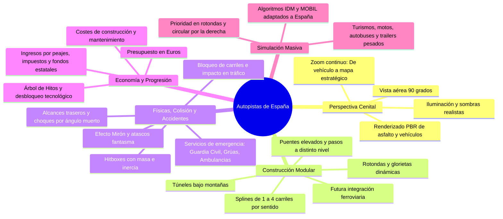
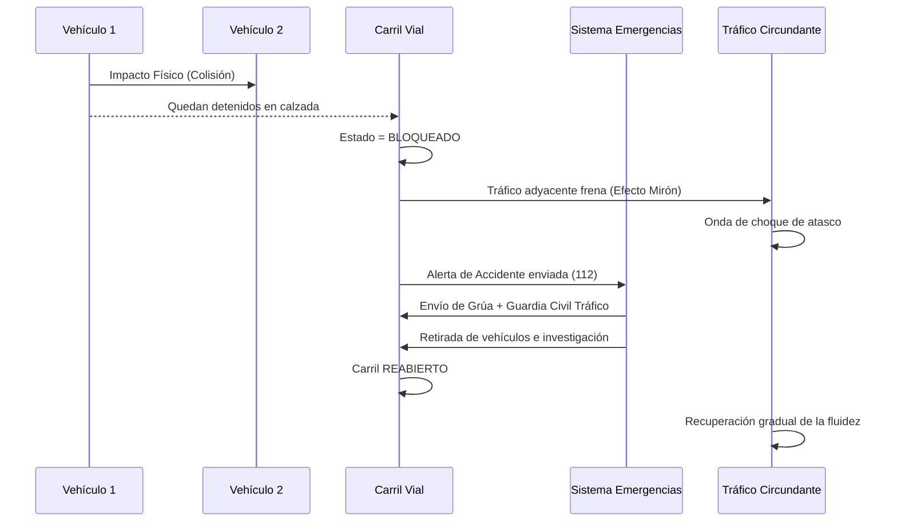
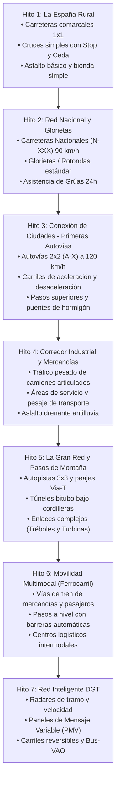

# Documento de Diseño del Juego (GDD) y Arquitectura Técnica
## "Autopistas de España: Simulador de Infraestructuras y Tráfico"

**Motor:** Unreal Engine 5.x  
**Género:** Simulación / Estrategia / Tycoon Vial / Sandbox  
**Perspectiva:** Cenital Realista (Top-Down 2D / 2.5D Orthographic / Narrow-FOV PBR)  
**Escala Oficial:** $1\text{ Unreal Unit (UU)} = 1\text{ cm} = 0.01\text{ m}$ (100 UU = 1 Metro)  
**Ambientación:** Red viaria española (Normativa DGT y Ministerio de Transportes)  
**Ruta del Motor:** `E:\APP\ENGINE`  

---

## 📂 Índice de Documentación Técnica y de Diseño

1. **[GDD Maestro (Este Documento)](file:///C:/app/game_autopista/GDD_Autopistas_Espana.md)**: Visión global, economía, normativa española y árbol de hitos.
2. **[01. Sistema de Guardado, Menús y Ciclo de Vida](file:///C:/app/game_autopista/docs/01_SISTEMA_GUARDADO_Y_MENUS.md)**: Menús dinámicos, asistente de generación sandbox, slots de guardado (F5/F9), autosave y reinicio de partida.
3. **[02. Mecánicas y Características Avanzadas](file:///C:/app/game_autopista/docs/02_MECANICAS_Y_CARACTERISTICAS_AVANZADAS.md)**: Ciclo día/noche, horas punta, climatología extrema (DANA, nieve, niebla), Centro DGT (Pegasus, PMV, radares) y desafíos de España.
4. **[03. Motor de Trazado Vial y Mallas Procedurales](file:///C:/app/game_autopista/docs/03_SISTEMA_TRAZADO_Y_FISICAS_ROAD_ENGINE.md)**: Matemáticas de splines, peraltes según norma 3.1-IC, viaductos (gálibo 5.5m), túneles, glorietas paramétricas y marcas 8.2-IC.
5. **[04. Físicas de Colisión, Accidentes y Gestión de Emergencias](file:///C:/app/game_autopista/docs/04_SISTEMA_COLISIONES_Y_EMERGENCIAS.md)**: Cajas OBB, probabilidad de accidentes, averías aleatorias, restos en calzada (debris), protocolo 112 y pasillo de emergencia.
6. **[05. Escala Métrica, Modelado 3D Propio y Sistema de Edificios](file:///C:/app/game_autopista/docs/05_ESCALA_MUNDO_MODELADO_Y_EDIFICIOS.md)**: Escala 1 UU = 1 cm, pipeline de modelado propio de vehículos, zonificación catastral por polígonos extruidos y accesos viales a parcelas.
7. **[06. Optimización de Escala y Sistemas Viales Avanzados](file:///C:/app/game_autopista/docs/06_OPTIMIZACION_ESCALA_Y_SISTEMAS_AVANZADOS.md)**: Arquitectura de rendimiento para evitar colapsos con miles de vehículos, obras en vivo con conos, áreas de servicio/tacógrafo, pasos de fauna (ecoductos), peajes Free-Flow y pantallas acústicas.
8. **[07. Centros de Transporte, Rutas y Señalización Vial Realista](file:///C:/app/game_autopista/docs/07_CENTROS_TRANSPORTE_RUTAS_Y_SENALIZACION.md)**: Estaciones de autobuses urbanas, parques logísticos, editor de rutas de transporte público/fletes, quitamiedos SPM para motoristas, barreras New Jersey y pórticos de salida Norma 8.1-IC.
9. **[08. Simulación DGT: Controles en Calzada, Guardia Civil y Pegasus](file:///C:/app/game_autopista/docs/08_SIMULACION_DGT_CONTROLES_Y_PEGASUS.md)**: Controles de alcoholemia/drogas, pesaje de camiones, inspección de tacógrafos, patrulla aérea con helicóptero radar Pegasus, drones y emisión activa de sanciones.
10. **[09. Plan de Desarrollo Modular por Pasos (Roadmap)](file:///C:/app/game_autopista/docs/09_PLAN_DESARROLLO_MODULAR_POR_PASOS.md)**: Hoja de ruta dividida en 8 pasos independientes y verificables (Cámara $\rightarrow$ Splines $\rightarrow$ Modelos 3D $\rightarrow$ Tráfico $\rightarrow$ Colisiones $\rightarrow$ Emergencias/DGT $\rightarrow$ Rutas/Hubs $\rightarrow$ Menús y Save/Load).
11. **[10. Tiempo de Obra e Impacto Constructivo y Psicología del Conductor](file:///C:/app/game_autopista/docs/10_IMPACTO_OBRAS_Y_PSICOLOGIA_CONDUCTOR.md)**: Mecánica opcional de tiempo de obras con conos y maquinaria, más sistema de humor, estrés, frustración y furia al volante (*Road Rage*) con bocinazos e invasión de arcén.
12. **[11. Diseño de la Interfaz Gráfica (HUD, Menús y UX)](file:///C:/app/game_autopista/docs/11_DISENO_INTERFAZ_GRAFICA_HUD_Y_UX.md)**: Barra superior de finanzas y siniestralidad, dock inferior de herramientas viales, paleta de colores oficial de carreteras españolas y notificaciones Toast del 112.
13. **[12. Sistema de Localización Bilingüe (Español / Inglés)](file:///C:/app/game_autopista/docs/12_SISTEMA_LOCALIZACION_BILINGUE_ES_EN.md)**: Subsistema de internacionalización en tiempo real con tabla de cadenas y soporte multilingüe.
14. **[13. Registro de Memoria y Progreso de Desarrollo (Dev Log)](file:///C:/app/game_autopista/docs/13_REGISTRO_DE_MEMORIA_Y_PROGRESO_DEV.md)**: Memoria persistente técnica con la matriz de estado de todos los módulos y decisiones de diseño.

---

## 1. Visión y Pilares Fundamentales



---

## 2. Perspectiva Visual y Sistema de Cámara

Para aunar la claridad táctica del 2D con el realismo visual moderno, el juego utiliza un **entorno 3D renderizado desde un ángulo cenital**.

### 2.1. Configuración de Cámara
- **Ángulo de Visión:** Cámara cenital a 90° (o teleobjetivo con inclinación ligera a 86° para dar volumen a puentes, túneles y laterales de camiones).
- **Control del Jugador:**
  - `W, A, S, D` o arrastre con ratón (botón central o borde de pantalla) para desplazar el visor.
  - `Rueda del Ratón`: Zoom continuo con dos modos de renderizado:
    1. **Nivel Táctico (Cerca):** Modelos 3D realistas, deformación de chapa en accidentes, intermitentes, marcas viales reflectantes, balizas luminosas, guardarraíles bionda de acero galvanizado y sonido posicional del motor.
    2. **Nivel Estratégico (Lejos):** Representación fluida de la red con mapa de calor estilo DGT/Google Maps (líneas verdes para tráfico fluido, amarillas para tráfico denso, rojas/negras para retenciones y accidentes señalizados con conos de emergencia).

---

## 3. Sistema de Físicas, Colisiones y Accidentes

Uno de los diferenciales clave del juego es que el tráfico no es una animación abstracta, sino una simulación física donde los errores humanos o de diseño vial provocan siniestros.

### 3.1. Detección de Colisiones
- Cada vehículo cuenta con una caja de colisión orientada (**OBB - Oriented Bounding Box**) y parámetros cinemáticos:
  - Masa $m$ (Moto: 180 kg, Turismo: 1.400 kg, Autobús: 14.000 kg, Tráiler: 40.000 kg).
  - Coeficiente de frenada $\mu$ según el estado del asfalto (Seco: 0.8, Mojado por lluvia: 0.45, Hielo en puertos: 0.15).
  - Tiempo de reacción del conductor $T_{\text{reac}}$ (entre 0.6s y 1.4s, variable según despiste o visibilidad).

### 3.2. Tipología y Causas de Accidentes
1. **Alcance Trasero por Frenazo Brusco:**
   - Ocurre cuando un vehículo no mantiene la distancia de seguridad prescrita o cuando una incorporación repentina obliga a clavar frenos.
2. **Choque Lateral en Cambio de Carril:**
   - Si un conductor realiza un cambio de carril agresivo (ej. para tomar una salida a última hora) y entra en el ángulo muerto de otro vehículo.
3. **Colisión en Incorporación o Rotonda:**
   - Un vehículo no respeta el "Ceda el Paso" en la entrada a una autovía o rotonda saturada.
4. **Salida de Vía / Aquaplaning:**
   - En curvas con radio inferior al recomendado para la velocidad de la vía (según la Norma 3.1-IC española) o por asfalto degradado con lluvia.
5. **Accidente en Paso a Nivel:**
   - Bloqueo en vía férrea al aproximarse un tren.

### 3.3. Dinámica Post-Accidente y Colapso Vial


- **Efecto Mirón (Rubbernecking):** Los vehículos que circulan en los carriles paralelos o en sentido contrario reducen su velocidad hasta un 40% para observar el accidente, propagando retenciones hacia atrás.
- **Servicios de Emergencia Activos:**
  - **Guardia Civil de Tráfico:** Corta y señaliza con conos el carril afectado.
  - **Ambulancia (061/112):** Reduce el tiempo de penalización por heridos graves.
  - **Grúa de Asistencia en Carretera:** Engancha y retira el vehículo siniestrado, liberando la vía.

---

## 4. Economía, Financiación y Progresión por Hitos

El jugador asume el papel de la Dirección General de Carreteras e Infraestructuras.

### 4.1. El Balance Financiero (€)

$$\text{Balance Mensual} = (\text{Peajes} + \text{Subvenciones Estatales} + \text{Canon Logístico}) - (\text{Construcción} + \text{Mantenimiento} + \text{Coste de Siniestralidad})$$

#### Fuentes de Ingreso:
- **Peajes:** Instalación de cabinas manuales o arcos de telepeaje *Via-T (Free-Flow)* en autopistas. Tarifa configurable (€/km). *Atención:* Si el peaje es muy caro, los coches elegirán carreteras secundarias colapsándolas.
- **Subvenciones del Estado / Fondos Europeos:** Pagos periódicos por mantener una red fluida y segura (con bonus si no hay víctimas mortales).
- **Canon Logístico de Polígonos:** Pagos de empresas de transporte de mercancías por conectar fábricas, centros logísticos y puertos secos.

#### Gastos y Costes:
- **Coste de Obra por Metro:**
  - Carretera básica asfaltada: 150 €/m.
  - Autovía 2x2: 600 €/m.
  - Autopista 3x3: 1.100 €/m.
  - Viaducto / Puente sobre valle o río: 3.500 €/m.
  - Túnel excavado en roca: 8.000 €/m.
- **Mantenimiento del Firme:** El paso de camiones pesados desgasta el asfalto. El asfalto en mal estado incrementa el riesgo de accidentes y reduce la velocidad media.
- **Coste de Siniestralidad:** Cada accidente genera pérdidas económicas por retrasos en el transporte y costes de rescate.

---

### 4.2. Árbol de Hitos (Progreso del Jugador)



---

## 5. El Catálogo de Infraestructuras (Normativa Española)

Todas las vías se rigen por la **Norma 3.1-IC de Trazado** y las marcas viales de la **Norma 8.2-IC**.

| Tipo de Vía | Carriles | Arcén | Velocidad Diseño | Elementos Clave |
| :--- | :--- | :--- | :--- | :--- |
| **Camino Rural / Agrícola** | 1 (bidireccional) | Tierra | 40 km/h | Tránsito de tractores y turismos lentos. |
| **Carretera Comarcal** | 1x1 | 0.5 m | 70 km/h | Línea continua en curvas peligrosas. |
| **Carretera Nacional (N-XXX)** | 1x1 | 1.5 m | 90 km/h | Hitos kilométricos rojos, carril adicional para lentos en cuestas. |
| **Autovía de Enlace (A-X)** | 2x2 | Ext. 2.5m / Int. 1.0m | 120 km/h | Mediana central con bionda metálica doble o barrera New Jersey. |
| **Autopista de Gran Capacidad (AP-X)**| 3x3 / 4x4 | Ext. 2.5m / Int. 1.5m | 120 km/h | Cartelería azul, pórticos de peaje y paneles luminosos. |
| **Ramal de Incorporación** | 1 unidireccional | 1.0 m | 60-80 km/h | Marcas gruesas discontinuas de entrada y salida. |
| **Glorieta / Rotonda** | 1 a 3 anillos | Perimetral | 40 km/h | Entrada con Ceda el Paso, prioridad para el vehículo en el anillo. |
| **Viaducto / Puente** | 1 a 4 por sentido| Barrera rígida | Según vía | Pilas de hormigón armado, juntas de dilatación. |
| **Túnel** | 1 a 3 por tubo | Acera evacuación | 80-100 km/h | Iluminación de sodio/LED cenital, ventiladores jet, bocas normalizadas. |
| **Paso a Nivel Ferroviario** | Cruce vía/calzada| N/A | Según vía | Aspa de San Andrés, señales luminosas rojas y semibarreras. |

---

## 6. Parque Móvil y Tipología de Vehículos

1. **Turismos:** Los más abundantes. Realizan viajes pendulares (vivienda $\leftrightarrow$ trabajo $\leftrightarrow$ ocio). Reaccionan a la congestión buscando atajos si el retraso supera los 10 minutos.
2. **Motocicletas:** Mucho más ágiles. Tienen aceleración rápida y pueden circular entre carriles en situaciones de atasco a baja velocidad.
3. **Autobuses de Línea / Interurbanos:** Conectan poblaciones. Si el tráfico está colapsado, su índice de puntualidad cae y genera protestas de los ciudadanos.
4. **Camiones de Gran Tonaje (Tráilers):** Obligados por ley a circular por el carril derecho en vías de 3 o más carriles. Aceleración lenta y gran distancia de frenado; si se accidentan, pueden cortar varios carriles.
5. **Vehículos de Asistencia y Emergencias:** Guardia Civil, grúas y ambulancias con balizas luminosas azules prioritarias (V-1). Los demás vehículos deben apartarse a los lados para formar el **pasillo de emergencia**.

---

## 7. Arquitectura Técnica en Unreal Engine 5 (`E:\APP\ENGINE`)

### 7.1. Estructura de Clases C++

```text
Source/AutopistasCore/
├── Architecture/
│   ├── AutopistasGameModeBase.h / .cpp       # Gestión del bucle de juego, tiempo y estados
│   ├── AutopistasPlayerController.h / .cpp   # Entrada de controles (Cámara, ratón, herramientas)
│   └── AutopistasTopDownCamera.h / .cpp      # Cámara cenital con zoom y proyección nítida
├── Roads/
│   ├── RoadSplineComponent.h / .cpp          # Geometría procedural del asfalto, peralte y capas
│   ├── RoadNetworkSubsystem.h / .cpp         # Grafo de red (Nodos, carriles y giros permitidos)
│   ├── IntersectionSolver.h / .cpp           # Generación matemática de rotondas y ramales
│   └── RoadTypes.h                           # Enums y structs (Carretera, Autovía, Puente, Túnel)
├── Traffic/
│   ├── TrafficSimulationSubsystem.h / .cpp   # Ejecutor multihilo de vehículos (Mass Entity/ECS)
│   ├── TrafficVehicleAgent.h / .cpp          # Lógica IDM de frenado y MOBIL de carril
│   ├── AccidentManager.h / .cpp              # Detección de colisiones, hitboxes y emergencias
│   └── TrafficSignsManager.h / .cpp          # Lógica de semáforos, límites y ceda el paso
├── Economy/
│   ├── EconomySubsystem.h / .cpp             # Caja de dinero, peajes, costes e impuestos
│   └── MilestonesSubsystem.h / .cpp          # Árbol de hitos y logros de desbloqueo
├── GIS/
│   ├── OSMDataParser.h / .cpp                # Lector de datos de carreteras reales de España
│   └── DEMElevationLoader.h / .cpp           # Importador de relieve real (IGN/CNIG)
└── Railway/
    ├── RailwayTrackComponent.h / .cpp        # Vías férreas, balasto y catenaria
    └── LevelCrossingActor.h / .cpp           # Barreras automáticas y semáforos de paso a nivel
```

### 7.2. Fórmulas de Tráfico Implementadas
- **Modelo de Conductor Inteligente (IDM):**
  $$a_{\text{IDM}} = a \left[ 1 - \left(\frac{v}{v_0}\right)^\delta - \left(\frac{s^*(v, \Delta v)}{s}\right)^2 \right]$$
- **Modelo MOBIL para Cambio de Carril en España:**
  Un vehículo cambia al carril izquierdo únicamente si adelanta y retorna inmediatamente a la derecha.

---

## 8. Sistema de Menús, Guardado, Carga y Reinicio (Save / Load / Restart)

Para garantizar la rejugabilidad y la persistencia de mundos gigantes:

### 8.1. Pantallas y Ciclo de Vida
- **Menú Principal:** Renderiza en tiempo real una autopista española cenital en funcionamiento con ciclo día/noche. Opciones: Continuar, Nueva Partida (Sandbox / Campaña / Importar Real), Cargar, Ajustes y Salir.
- **Asistente de Mundo (Sandbox):** Ajuste de dimensiones ($4\times 4\text{ km}$ hasta $32\times 32\text{ km}$), orografía (meseta, costa, montaña), densidad de ciudades y polígonos, frecuencia de accidentes y clima.
- **Menú de Pausa:** Acceso en cualquier momento con `Escape`: Reanudar, Guardar Partida, Cargar, Ajustes, Reiniciar Nivel y Salir al Menú.
- **Modalidades de Reinicio (Restart):**
  1. *Reiniciar con la misma semilla de terreno:* Limpia la red de carreteras pero conserva montañas, ríos y ciudades para reintentar el trazado desde cero.
  2. *Reiniciar con nuevo mapa:* Genera una orografía y distribución urbana totalmente aleatoria.

### 8.2. Serialización y Ranuras (C++)
- Clase `FAutopistasSaveData` serializable en binario/JSON para guardar y cargar en menos de 2 segundos.
- Soporte para ranuras múltiples con nombre, fecha, fondos (€), habitantes y captura de miniatura (thumbnail) de la vista cenital.
- **Guardado rápido (`F5`)** y **Carga rápida (`F9`)**.
- **Autoguardado periódico rotativo** cada 5, 10 o 15 minutos en segundo plano.

---

## 9. Características Avanzadas de Dinamismo y Realismo Ibérico

1. **Ciclo Día / Noche y Horas Punta (Rush Hour):**
   - **07:30 - 09:30:** Hora punta matinal (tráfico pendular de trabajadores hacia centros urbanos e industrias).
   - **18:00 - 20:30:** Retorno a zonas residenciales con retenciones en ramales de salida.
   - **22:00 - 06:00:** Caída del 80% en turismos y explosión del tráfico nocturno de camiones pesados y logística. Iluminación nocturna con faros, farolas en enlaces y túneles iluminados.
2. **Climatología Dinámica y Campañas DGT:**
   - Lluvia intensa (DANA) con riesgo de aquaplaning y asfalto deslizante.
   - Temporales de nieve en cotas altas que exigen camiones quitanieves y embolsamiento de camiones en áreas de servicio.
   - Niebla densa con activación de balizas luminosas en guardarraíles.
   - *Operación Salida (Verano y Puentes):* Oleadas masivas de coches hacia las costas con posibilidad de abrir carriles reversibles adicionales con conos.
3. **Centro de Gestión Activa de Tráfico DGT:**
   - Paneles de Mensaje Variable (PMV) interactivos en pórticos para alertar de atascos y desviar el tráfico anticipadamente.
   - Radares fijos de arcén y de tramo en túneles para controlar excesos de velocidad y recaudar sanciones.
   - Semáforos adaptativos con espiras magnéticas bajo el asfalto.
4. **Modos de Campaña de España:**
   - *El Paso de Despeñaperros:* Sustituir la peligrosa carretera antigua por viaductos y túneles modernos.
   - *El Soterramiento de la M-30:* Desviar una circunvalación colapsada bajo tierra.
   - *Operación Paso del Estrecho:* Gestionar el masivo tráfico hacia Algeciras sin bloquear las autovías A-4 y A-7.
   - *El Corredor Mediterráneo:* Construir la red ferroviaria para retirar miles de camiones del asfalto.

---

## 10. Hoja de Ruta Inmediata (Mientras se completa la instalación)

1. **Fase A (Actual - Diseño y Documentación Exhaustiva):**
   - Especificaciones completas redactadas en la carpeta `docs/` (`01_SISTEMA_GUARDADO_Y_MENUS.md`, `02_MECANICAS_Y_CARACTERISTICAS_AVANZADAS.md`, `03_SISTEMA_TRAZADO_Y_FISICAS_ROAD_ENGINE.md`, `04_SISTEMA_COLISIONES_Y_EMERGENCIAS.md`).
2. **Fase B (Al finalizar la descarga de UE en `E:\APP\ENGINE`):**
   - Creación del proyecto base C++ configurado para Top-Down Cenital.
   - Configuración de plugins indispensables (`ProceduralMeshComponent`, `EnhancedInput`, `MassEntity`).
3. **Fase C (Primer Prototipo Jugable):**
   - Trazado con ratón de una carretera de 2 carriles y una incorporación.
   - Spawn de turismos y camiones con físicas de frenado y colisión.
   - Verificación de la reacción en cadena cuando un coche se frena o colisiona.

