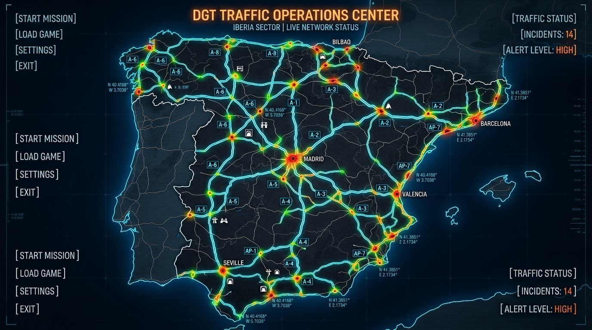

# 🛣️ Autopistas de España - Simulador de Infraestructuras y Tráfico

Videojuego de estrategia, simulación y gestión de infraestructuras viales en vista cenital realista (Top-Down 2.5D) desarrollado sobre **Unreal Engine 5**.

---

## 🌟 Características Principales

- **Vista Cenital Realista (2.5D PBR):** Renderizado de alta fidelidad con iluminación dinámica, sombras nítidas y cámara aérea continua (desde vista cercana de vehículos y asfalto hasta visión estratégica comarcal).
- **Red Vial Oficial Española:** Trazado de carreteras convencionales (90 km/h), autovías 2x2 (120 km/h), autopistas de gran capacidad 3x3, glorietas paramétricas con ceda el paso, viaductos con pilas de hormigón automáticas y túneles bajo montaña.
- **Motor de Tráfico Masivo (IDM + MOBIL):** Algoritmos de seguimiento y cambio de carril adaptados al código de circulación de España (circular por la derecha y adelantar por la izquierda).
- **Psicología y Humor del Conductor:** Medidor de frustración y estados de ánimo (desde *Tranquilo* hasta *Furia al Volante* con pitidos de claxon e invasiones de arcén).
- **Físicas de Colisión y Siniestralidad:** Choques físicos con desprendimiento de piezas (paragolpes, ruedas), bloqueo de carriles, protocolo 112 con Guardia Civil de Tráfico, ambulancias y grúas de asistencia.
- **Operativos DGT y Helicóptero Pegasus:** Despliegue de controles de alcoholemia con conos reflectantes, pesaje de camiones y patrulla aérea con radar cenital para multar excesos de velocidad.
- **Centros de Transporte y Rutas:** Estaciones de autobuses urbanas, parques logísticos y creación de líneas de transporte público para descongestionar autovías.

---

## 📐 Escala Métrica Oficial

- **$1\text{ Unreal Unit (UU)} = 1\text{ centímetro (cm)} = 0.01\text{ metros}$** ($100\text{ UU} = 1\text{ metro}$).
- Carril estándar: $350\text{ UU}$ ($3.50\text{ m}$).
- Arcén exterior autovía: $250\text{ UU}$ ($2.50\text{ m}$).
- Turismo compacto: $420 \times 180 \times 145\text{ UU}$ ($4.2 \times 1.8 \times 1.45\text{ m}$).
- Tráiler articulado: $1650 \times 255 \times 400\text{ UU}$ ($16.5 \times 2.55 \times 4.0\text{ m}$).

---

## 📚 Documentación Técnica

La documentación completa de arquitectura e ingeniería se encuentra en la carpeta [`docs/`](docs/):

1. [`01_SISTEMA_GUARDADO_Y_MENUS.md`](docs/01_SISTEMA_GUARDADO_Y_MENUS.md)
2. [`02_MECANICAS_Y_CARACTERISTICAS_AVANZADAS.md`](docs/02_MECANICAS_Y_CARACTERISTICAS_AVANZADAS.md)
3. [`03_SISTEMA_TRAZADO_Y_FISICAS_ROAD_ENGINE.md`](docs/03_SISTEMA_TRAZADO_Y_FISICAS_ROAD_ENGINE.md)
4. [`04_SISTEMA_COLISIONES_Y_EMERGENCIAS.md`](docs/04_SISTEMA_COLISIONES_Y_EMERGENCIAS.md)
5. [`05_ESCALA_MUNDO_MODELADO_Y_EDIFICIOS.md`](docs/05_ESCALA_MUNDO_MODELADO_Y_EDIFICIOS.md)
6. [`06_OPTIMIZACION_ESCALA_Y_SISTEMAS_AVANZADOS.md`](docs/06_OPTIMIZACION_ESCALA_Y_SISTEMAS_AVANZADOS.md)
7. [`07_CENTROS_TRANSPORTE_RUTAS_Y_SENALIZACION.md`](docs/07_CENTROS_TRANSPORTE_RUTAS_Y_SENALIZACION.md)
8. [`08_SIMULACION_DGT_CONTROLES_Y_PEGASUS.md`](docs/08_SIMULACION_DGT_CONTROLES_Y_PEGASUS.md)
9. [`09_PLAN_DESARROLLO_MODULAR_POR_PASOS.md`](docs/09_PLAN_DESARROLLO_MODULAR_POR_PASOS.md)
10. [`10_IMPACTO_OBRAS_Y_PSICOLOGIA_CONDUCTOR.md`](docs/10_IMPACTO_OBRAS_Y_PSICOLOGIA_CONDUCTOR.md)
11. [`11_DISENO_INTERFAZ_GRAFICA_HUD_Y_UX.md`](docs/11_DISENO_INTERFAZ_GRAFICA_HUD_Y_UX.md)

---

## 🛠️ Tecnologías y Requisitos

- **Motor:** Unreal Engine 5.x (`UE_5.8`)
- **Lenguaje:** C++20 con UBT / Enhanced Input / ProceduralMeshComponent / UMG
- **Assets Propios:** Modelos 3D Low-to-Mid Poly creados mediante generadores procedurales matemáticos en Python (`Tools/`).
