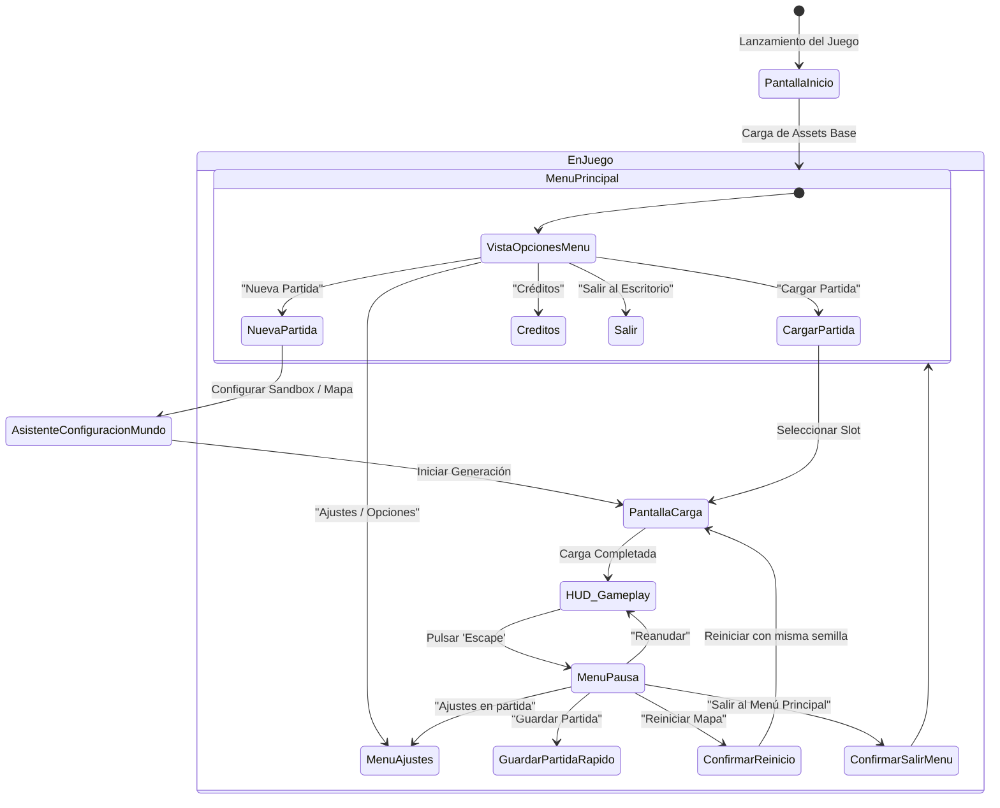

# 01 - Sistema de Menús, Guardado, Carga y Ajustes
## Proyecto "Autopistas de España"

Este documento especifica la arquitectura de la interfaz de usuario, el ciclo de vida del juego, los menús de carga/pausa y el sistema de serialización de partidas (Save/Load/Autosave/Restart).

---

## 1. Arquitectura del Flujo de Pantallas y Menús



---

## 2. Menú Principal y Estética Visual

### 2.1. Fondo Cinemático Dinámico
El menú principal no es una imagen estática. En el fondo se renderiza una escena en tiempo real de una autopista española vista desde arriba:
- Turismos y camiones circulando a velocidad constante con faros encendidos y sombras suaves.
- Ciclo suave de transición día-atardecer-noche en el fondo mientras el usuario navega por las opciones.
- Música ambiental relajante de simulación estratégica con efectos de sonido atenuados de rodadura sobre asfalto.

### 2.2. Opciones del Menú Principal
1. **Continuar:** Carga directamente la última partida jugada (autoguardado o guardado manual más reciente).
2. **Nueva Partida:**
   - **Modo Sandbox / Libre:** Dinero infinito, catálogo completo desbloqueado, generador de terreno a la carta.
   - **Modo Campaña / Retos de España:** Escenarios históricos con presupuesto limitado (ej. *El Nudo de Despeñaperros*, *La M-30 y Rondas de Circunvalación*, *Operación Salida en el Corredor Mediterráneo*).
   - **Modo Importar Mapa Real:** Selector de archivos OSM o descarga directa por coordenadas de cualquier municipio de España.
3. **Cargar Partida:**
   - Lista de ranuras (Slots) con fecha, hora, tiempo jugado, fondos (€), número de habitantes conectados y miniatura visual (thumbnail) del mapa capturada al guardar.
4. **Ajustes:**
   - Opciones gráficas, controles y sonido.
5. **Salir:** Cierre seguro del juego.

---

## 3. Asistente de Configuración de Nueva Partida (Sandbox)

Antes de generar el mundo, el jugador puede parametrizar las variables clave:

| Parámetro | Opciones Disponibles | Impacto en la Partida |
| :--- | :--- | :--- |
| **Tamaño del Mundo** | 4x4 km (Comarcal), 8x8 km (Regional), 16x16 km (Metropolitano), 32x32 km (Provincial) | Determina la memoria RAM requerida y la distancia entre ciudades. |
| **Relieve / Orografía** | Meseta Llana, Valles Fluviales, Costa Mediterránea, Cordillera Montañosa | Dificultad para trazar carreteras; mayor o menor necesidad de puentes y túneles caros. |
| **Densidad de Ciudades** | Poca (2-3 grandes urbes aisladas), Media (5-8 municipios), Alta (Múltiples pueblos y polígonos) | Determina el volumen de tráfico de viajeros. |
| **Actividad Industrial** | Baja, Equilibrada, Polo Logístico Pesado | Determina la proporción de camiones de gran tonelaje en la red. |
| **Frecuencia de Accidentes** | Desactivado (Tráfico perfecto), Realista (Basado en climatología y diseño vial), Caos Vial | Permite adaptar el reto a jugadores noveles o amantes de la gestión de emergencias. |
| **Climatología Dinámica** | Sí / No | Lluvias repentinas, niebla y temporales de nieve en puertos de montaña. |
| **Presupuesto Inicial** | 1.000.000 € (Modo Difícil), 5.000.000 € (Estándar), Infinito (Sandbox Puro) | Capital disponible para las primeras obras. |

---

## 4. Sistema de Guardado y Carga de Partidas (Save / Load)

Para garantizar que un mapa gigante con miles de tramos viales y vehículos se guarde y cargue en menos de 2 segundos, se utiliza un sistema de **serialización binaria y jerárquica en C++** mediante la clase `USaveGame` de Unreal Engine.

### 4.1. Estructura de Datos Guardada (`FAutopistasSaveData`)

```cpp
USTRUCT()
struct FAutopistasSaveData
{
    GENERATED_BODY()

    // Metadatos de la Partida
    UPROPERTY() FString SaveSlotName;
    UPROPERTY() FDateTime Timestamp;
    UPROPERTY() float TotalPlayTimeSeconds;
    UPROPERTY() TArray<uint8> ScreenshotThumbnailJPEG;

    // Estado Económico y Progresión
    UPROPERTY() int64 BudgetEuros;
    UPROPERTY() int32 CurrentMilestoneTier;
    UPROPERTY() float RoadSafetyRating;

    // Generador y Entorno
    UPROPERTY() int32 WorldSeed;
    UPROPERTY() FVector2D WorldDimensionsKm;
    UPROPERTY() float CurrentTimeOfDay; // 0.0f a 24.0f horas

    // Grafo de Carreteras y Vías (Topología Completa)
    UPROPERTY() TArray<FSavedRoadSegment> RoadSegments;
    UPROPERTY() TArray<FSavedIntersectionNode> IntersectionNodes;
    UPROPERTY() TArray<FSavedTollBooth> TollBooths;
    UPROPERTY() TArray<FSavedSpeedCamera> SpeedCameras;

    // Ciudades e Industrias
    UPROPERTY() TArray<FSavedCityZone> CityZones;
    UPROPERTY() TArray<FSavedIndustrialHub> IndustrialHubs;

    // Agentes de Tráfico Activos (Opcional o Regenerados al Cargar)
    UPROPERTY() TArray<FSavedVehicleTripState> ActiveVehicles;
};
```

### 4.2. Tipos de Guardado Disponibles
1. **Guardado Manual:** El jugador puede crear tantas ranuras como desee con nombre personalizado.
2. **Guardado Rápido (Quick Save):** Tecla `F5`. Sobrescribe la ranura de guardado rápido instantáneamente.
3. **Carga Rápida (Quick Load):** Tecla `F9`.
4. **Autoguardado Automático (Autosave):** Cada 5, 10 o 15 minutos (configurable en opciones) y rotativo entre 3 slots para evitar corrupción de datos.

### 4.3. Opción de "Reiniciar Partida" (Restart)
En el menú de pausa se ofrecen dos modalidades de reinicio:
- **Reiniciar manteniendo el Terreno (Misma semilla):** Borra todas las carreteras construidas, devuelve el presupuesto inicial y permite al jugador volver a intentarlo en el mismo mapa aprendiendo de sus errores previos.
- **Reiniciar Nuevo Mapa (Semilla aleatoria):** Genera una orografía y distribución de ciudades totalmente nueva.

---

## 5. Pantalla de Carga y Transiciones

- **Indicador de Progreso Porcentual Real:**
  1. Inicialización del motor físico (10%).
  2. Generación o carga de la malla de terreno (30%).
  3. Reconstrucción del grafo de splines y mallas de carreteras (60%).
  4. Población de ciudades y cálculo de rutas O-D (85%).
  5. Instanciación del tráfico inicial y arranque de la simulación (100%).
- **Consejos Viales de Carga (Tips de la DGT):** Durante la carga, se muestran consejos útiles de ingeniería vial y normativa española:
  - *"Consejo DGT: Las rotondas reducen los accidentes con víctimas en un 70% frente a cruces en cruz tradicionales."*
  - *"Consejo de Trazado: Incluir un carril de deceleración largo permite a los coches salir de la autovía sin frenar a los del carril derecho."*
  - *"Mantenimiento: El asfalto drenante reduce el riesgo de aquaplaning en zonas de lluvia intensa."*
  - *"Ferrocarril: Un tren de mercancías puede retirar hasta 40 camiones de la autovía, descongestionando los corredores logísticos."*

---

## 6. Panel de Ajustes y Accesibilidad

1. **Gráficos:**
   - Resolución, Modo Pantalla Completa / Ventana sin bordes.
   - Calidad de Sombras, Oclusión Ambiental, Iluminación Global (Lumen On/Off según hardware).
   - Nivel de Anti-Aliasing (TSR / TAA / FSR).
   - Límite de FPS (30, 60, 120, Ilimitado).
2. **Jugabilidad y Controles:**
   - Velocidad de paneo de cámara (WASD y ratón).
   - Inversión de zoom en rueda de ratón.
   - Frecuencia del autoguardado.
   - Idioma (Español / Inglés / Catalán / Gallego / Euskera).
3. **Audio:**
   - Volumen Master, Música, Efectos de Sonido (motores, frenadas, sirenas), Notificaciones de Alerta vial.
