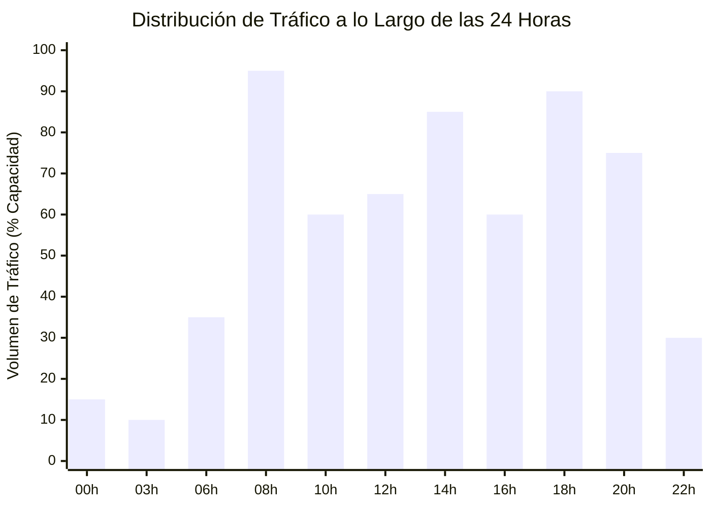
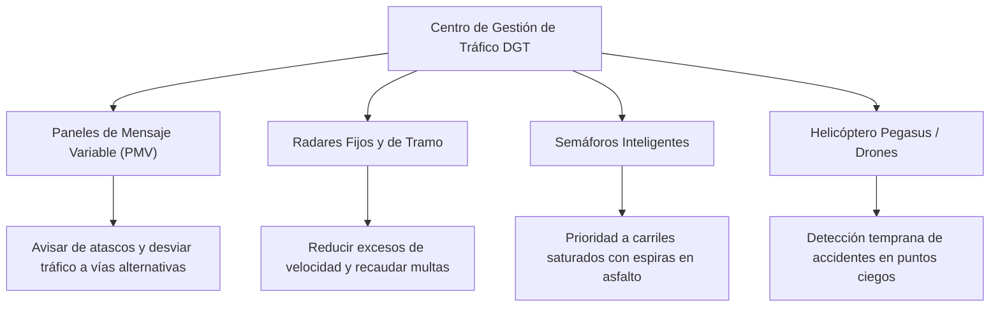

# 02 - Mecánicas y Características Avanzadas
## Proyecto "Autopistas de España"

Este documento profundiza en las mecánicas de juego avanzadas que convierten el título en un simulador de tráfico vivo, desafiante y con identidad propia de la realidad viaria de España.

---

## 1. Ciclo Día / Noche y Fenómeno de las "Horas Punta"

El flujo de tráfico no es constante a lo largo del tiempo. Sigue los patrones sociolaborales reales de España:

### 1.1. Franjas Horarias Críticas:
- **07:30 – 09:30 (Hora Punta de la Mañana):** Éxodo masivo desde áreas residenciales y ciudades dormitorio hacia polígonos industriales y centros financieros. Prueba de fuego para los carriles de entrada y enlaces de circunvalación.
- **14:00 – 15:30 (Hora del Almuerzo / Salida Escolar):** Picos de tráfico local en accesos urbanos.
- **18:00 – 20:30 (Hora Punta de la Tarde):** Retorno hacia las zonas residenciales y salidas comerciales. Los carriles de salida de las autovías sufren embotellamientos si los ramales son cortos.
- **22:00 – 06:00 (Tráfico Nocturno de Logística Pesada):** Los turismos caen al mínimo, pero **se dispara el tráfico de camiones de gran tonelaje** (mercancías nocturnas para distribución matinal en supermercados y fábricas). Es el momento idóneo para que el jugador realice obras de reasfaltado con menor impacto económico.

### 1.2. Iluminación Nocturna Realista:
- Los vehículos encienden sus faros de xenón/LED y pilotos traseros rojos, iluminando el asfalto.
- Farolas de sodio/LED en nudos de enlace, áreas de servicio y glorietas.
- Túneles con iluminación permanente reforzada en las embocaduras para evitar el "efecto deslumbramiento/agujero negro" según normativa de seguridad en túneles del Ministerio de Transportes.

---

## 2. Climatología Dinámica y Campañas Especiales de la DGT

El clima en España es muy diverso según la región del mapa (Norte lluvioso, Meseta extrema, Sur soleado):

| Fenómeno Meteorológico | Efectos en la Conducción | Solución / Gestión por el Jugador |
| :--- | :--- | :--- |
| **Lluvia Intensa (DANA / Tormenta)** | El agarre del asfalto cae un 45%. Aumenta la distancia de frenado y el riesgo de aquaplaning. Los coches reducen la velocidad a 80-90 km/h. | Construir asfalto drenante antilluvia; instalar paneles luminosos recomendando reducir velocidad. |
| **Temporal de Nieve (Ola de Frío)** | La nieve cuaja en puertos de montaña y cotas altas. Bloqueo total de carriles si no se limpia. | Enviar camiones quitanieves con salmuera; habilitar zonas de embolsamiento para camiones en áreas de servicio. |
| **Niebla Densa** | Reduce la visibilidad a menos de 50 metros. Multiplica por 5 el riesgo de accidentes por alcance trasero. | Instalar balizas luminosas antiniebla en las biondas laterales y reducir límites en paneles variables. |
| **Operación Salida (Verano y Puentes)** | Los viernes por la tarde y primeros de julio/agosto, el tráfico hacia zonas de costa o montaña se multiplica por 300%. | Habilitar carriles reversibles o adicionales en sentido contrario mediante conos de señalización; incentivar el uso de autopistas de peaje con tarifas bonificadas. |

---

## 3. Centro de Gestión de Tráfico DGT (Herramientas Activas)

A medida que el jugador avanza de hito, desbloquea herramientas de control inteligente de la red:

### 3.1. Paneles de Mensaje Variable (PMV):
Pórticos metálicos sobre la autovía donde el jugador puede seleccionar mensajes dinámicos:
- `"RETENCIÓN A 2 KM - USE SALIDA ALTERNATIVA"` $\rightarrow$ El 40% de los vehículos buscará otra ruta antes de entrar al cuello de botella.
- `"PELIGRO NIEBLA - MÁX 60 KM/H"` $\rightarrow$ Reduce la velocidad y evita choques en cadena.
- `"CARRIL DERECHO EN OBRAS"` $\rightarrow$ Los coches cambian de carril 500 metros antes del obstáculo, evitando paradas de golpe.

### 3.2. Radares de Velocidad y Sanciones:
- **Radares Fijos (Cajas DGT en arcén):** Frenan a los conductores en zonas de curvas peligrosas o bajadas pronunciadas.
- **Radares de Tramo:** Controlan la velocidad media a lo largo de un túnel o viaducto largo.
- **Impacto Económico:** Los excesos de velocidad sancionados aportan pequeños ingresos por multas que ayudan a amortizar el coste del radar.

---

## 4. Satisfacción Ciudadana y Opinión Pública

El éxito de la red no se mide solo en dinero, sino en el **Índice de Aprobación de la Movilidad (0 - 100%)**:
- **Factores Positivos (+):** Tiempos de trayecto rápidos, asfalto en perfecto estado, cero atascos en horas punta, transporte público puntual.
- **Factores Negativos (-):** Atascos diarios de más de 30 minutos, peajes excesivamente caros, carreteras sin reasfaltar con socavones, siniestralidad mortal sin resolver en "puntos negros".
- **Consecuencias:** Si la aprobación cae por debajo del 30%, los ayuntamientos protestan, el Ministerio de Transportes puede congelar los fondos de subvención y los transportistas pueden convocar paros que paralizan la industria.

---

## 5. Modo Campaña: "Los Grandes Desafíos de España"

Además del modo Sandbox infinito, el juego ofrece escenarios prediseñados basados en nudos viales reales y míticos de la historia de España:

### 1. El Paso de Despeñaperros (Sierra Morena)
- **El Reto:** La antigua carretera nacional N-IV atraviesa un cañón rocoso con curvas mortales, túneles estrechos de un solo sentido y constantes vuelcos de camiones.
- **Misión:** Diseñar la nueva autovía A-4 mediante viaductos colosales y túneles paralelos sin cortar el tráfico durante las obras y dentro del presupuesto.

### 2. El Soterramiento de la M-30 y Rondas Urbanas
- **El Reto:** Una metrópoli gigante tiene su circunvalación colapsada a todas horas, dividiendo barrios y con niveles récord de contaminación.
- **Misión:** Diseñar falsos túneles y túneles subterráneos con accesos y salidas subterraneas complejas para desviar el tráfico de paso bajo tierra.

### 3. Operación Paso del Estrecho (OPE - Algeciras)
- **El Reto:** Miles de vehículos cruzan la península de norte a sur durante el mes de julio para embarcar hacia el norte de África.
- **Misión:** Evitar el colapso de las autovías A-4 y A-7 habilitando áreas de descanso gigantes, carriles rápidos y gestión de colas sin interrumpir el comercio local.

### 4. El Corredor del Mediterráneo (Autovías vs Tren de Mercancías)
- **El Reto:** El tráfico de camiones de exportación hortofrutícola colapsa la autovía del Mediterráneo.
- **Misión:** Construir la red ferroviaria paralela para transportar semirremolques en trenes ("autopista ferroviaria"), retirando miles de camiones del asfalto.

---

## 6. Integración Ferroviaria a Fondo

El ferrocarril se introduce en el Hito 6 no como un juego separado, sino como el **aliado estratégico para salvar las autopistas del colapso**:
- **Trenes de Cercanías:** Un solo tren puede transportar a 800 viajeros, eliminando entre 400 y 600 coches de la autovía en plena hora punta.
- **Terminales Intermodales de Mercancías:** Los camiones descargan sus contenedores en estaciones de tren logísticas. La mercancía pesada viaja en tren hacia los puertos, desahogando el carril derecho de las autovías.
- **Seguridad en Pasos a Nivel:**
  - Si una carretera secundaria cruza la vía de tren, se genera un paso a nivel.
  - Al aproximarse un tren a 1 km, suenan las campanas, parpadean las luces rojas y caen las semibarreras.
  - El tráfico rodado se detiene obligatoriamente. Si el tráfico en la carretera es muy denso, las colas pueden bloquear cruces cercanos, obligando al jugador a **sustituir el paso a nivel por un puente o paso inferior**.
