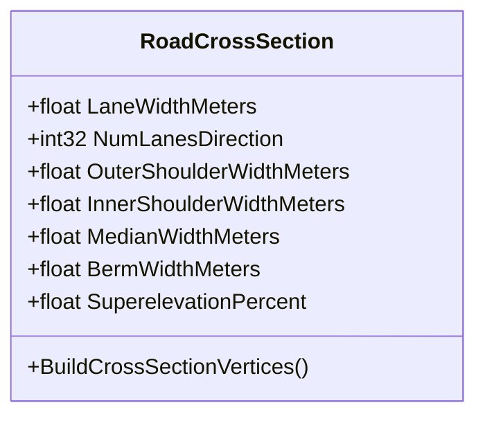
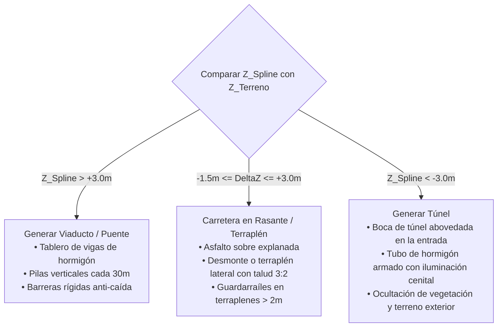
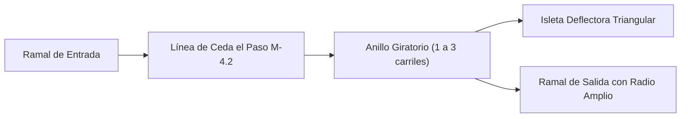

# 03 - Sistema de Trazado Vial y Mallas Procedurales (Road Engine)
## Proyecto "Autopistas de España"

Este documento establece las especificaciones matemáticas, de ingeniería civil y de renderizado procedural para el trazado de carreteras, autovías, puentes, túneles y glorietas en Unreal Engine 5, basado en la **Normativa Española de Carreteras (Norma 3.1-IC y 8.2-IC)**.

---

## 1. Parámetros Geométricos de las Secciones Tipo (Norma 3.1-IC)

En el motor, cada tipo de carretera se compone de un perfil transversal paramétrico extruido a lo largo de un `USplineComponent`:

### 1.1. Dimensiones Oficiales Implementadas:
| Elemento de la Calzada | Carretera Convencional (90 km/h) | Autovía / Autopista (120 km/h) | Ramal de Enlace (60-80 km/h) |
| :--- | :--- | :--- | :--- |
| **Ancho de Carril** | $3.50\text{ m}$ | $3.50\text{ m}$ (ampliable a $3.75\text{ m}$) | $4.00\text{ m}$ (para permitir adelantamiento en avería) |
| **Arcén Exterior** | $1.50\text{ m}$ pavimentado | $2.50\text{ m}$ pavimentado | $1.50\text{ m}$ pavimentado |
| **Arcén Interior** | N/A (calzada única) | $1.00\text{ m}$ pavimentado | $1.00\text{ m}$ pavimentado |
| **Berna / Margen** | $0.50\text{ m}$ tierra/zahorra | $1.00\text{ m}$ con bionda metálica | $0.75\text{ m}$ |
| **Mediana Central** | N/A | $2.00\text{ m}$ a $5.00\text{ m}$ (barrera New Jersey o bionda doble) | N/A |
| **Radio de Curva Mínimo** | $R_{\min} = 350\text{ m}$ | $R_{\min} = 700\text{ m}$ ($900\text{ m}$ deseable) | $R_{\min} = 120\text{ m}$ |
| **Peralte Máximo** | $7\%$ | $8\%$ | $8\%$ |

---

## 2. Generación Matemática de Mallas Procedurales (`UProceduralMeshComponent`)

### 2.1. Algoritmo de Extrusión por Segmentos de Spline
Para cada tramo entre dos puntos de spline $P_i$ y $P_{i+1}$:
1. Se calculan las tangentes y el vector normal ascendente $\vec{U} = (0, 0, 1)$ y lateral $\vec{R} = \vec{T} \times \vec{U}$.
2. Se evalúa el peralte $e(s)$ en función del radio de curvatura $R(s)$:
   $$e = \frac{v^2}{127 \cdot R} - f_t$$
   Donde $v$ es la velocidad de diseño (km/h) y $f_t$ es el coeficiente de rozamiento transversal.
3. Se rotan los vértices transversales según el ángulo de peralte $\theta = \arctan(e / 100)$.
4. Se generan las coordenadas UV mapeadas en metros reales para evitar estiramientos de textura en curvas:
   - Coordenada $U$: Proporcional al ancho de carril ($0.0$ a $1.0$ por carril para alinear marcas viales).
   - Coordenada $V$: Longitud recorrida en metros a lo largo del spline dividida por la escala del material ($V = \frac{\text{Distance}}{4.0\text{m}}$).

---

## 3. Generación de Puentes, Viaductos y Túneles

La altura $Z$ del spline respecto al terreno subyacente $Z_{\text{terreno}}$ determina automáticamente el tipo de estructura:

### 3.1. Puentes y Viaductos:
- Se colocan apoyos (pilas circulares o dobles rectangulares de hormigón visto) espaciadas a intervalos regulares ($L = 25 - 35\text{ m}$) proyectadas verticalmente hasta colisionar con el suelo o el lecho del río.
- En caso de cruzar sobre otra carretera preexistente, el algoritmo **detecta el gálibo mínimo legal de 5.5 metros** y ajusta el vano libre para que no caigan pilares sobre los carriles inferiores.

### 3.2. Túneles:
- En las transiciones entre el exterior y el interior de la montaña, se genera una **Embocadura de Túnel** con hastiales y aletas laterales de hormigón.
- El interior del túnel cuenta con una galería abovedada con textura de hormigón proyectado/prefabricado, aceras de evacuación laterales de 0.75m y luminarias LED/sodio cada 10 metros.

---

## 4. Algoritmo de Glorietas / Rotondas Paramétricas

Las rotondas son un elemento neurálgico en la red vial española para resolver cruces de forma segura:

### 4.1. Parámetros de Diseño de la Glorieta:
- **Radio Exterior ($R_e$):** De $18\text{ m}$ (rotonda urbana) a $40\text{ m}$ (rotonda interurbana en carreteras nacionales).
- **Isleta Central:** Radio interior ajardinado o adoquinado con corona de bordillo remontable de $1.5\text{ m}$ para camiones de gran radio de giro.
- **Número de Carriles en Anillo:** 1, 2 o 3 carriles concéntricos según la demanda de tráfico.
- **Conexión Tangencial Automática:**
  Cuando el jugador conecta una carretera a la glorieta:
  1. El sistema calcula la recta tangente al círculo en el punto de intersección.
  2. Divide la calzada en dos ramales: entrada deflectada con ángulo para obligar a frenar a $40\text{ km/h}$, y salida ensanchada para evacuación rápida.
  3. Coloca automáticamente la señal R-1 (Ceda el Paso) y la marca vial en el asfalto.

---

## 5. Señalización y Marcas Viales Españolas (Norma 8.2-IC)

Las marcas viales se proyectan con calcomanías (Decals) o se integran en el shader del asfalto mediante máscaras UV:

1. **Línea Longitudinal Discontinua (Separación de Carriles):**
   - Trazo de $3.0\text{ m}$ y vano de $10.0\text{ m}$ en autovías a 120 km/h (M-1.1).
   - Trazo de $2.0\text{ m}$ y vano de $5.5\text{ m}$ en carreteras convencionales a 90 km/h.
2. **Línea Continua (Prohibición de Cambio de Carril):**
   - Ancho de $15\text{ cm}$ en accesos a túneles, puentes estrechos y curvas peligrosas (M-2.1).
3. **Flechas de Selección de Carril (M-5.1):**
   - Flechas rectas, de giro y combinadas impresas en el pavimento 150m antes de salidas e intersecciones.
4. **Bandas Sonoras Fresadas:**
   - Líneas de resalte en el arcén exterior que provocan vibración y sonido en caso de despiste del conductor para evitar salidas de vía.
