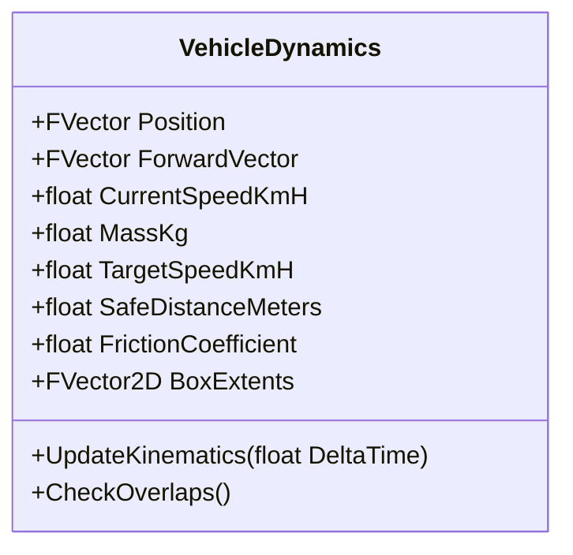
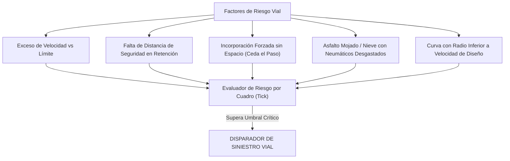
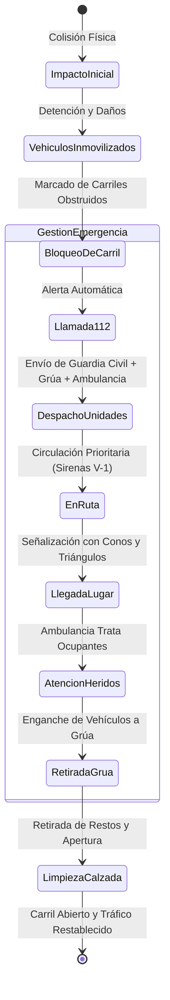

# 04 - Sistema de Físicas de Colisión, Accidentes y Gestión de Emergencias
## Proyecto "Autopistas de España"

Este documento describe la arquitectura cinemática de los vehículos, la física de colisiones, el generador estocástico de siniestros viales y el protocolo completo de respuesta de los servicios de emergencia (Guardia Civil de Tráfico, 061/112 y grúas de asistencia).

---

## 1. Física de Movimiento y Cajas de Colisión

Cada vehículo en la red viaria posee un cuerpo cinemático simplificado orientado (**OBB - Oriented Bounding Box**) y un perfil dinámico:

### 1.1. Parámetros Cinemáticos por Categoría de Vehículo:
| Categoría | Longitud x Anchura | Masa ($m$) | Acel. Máx ($a$) | Frenada Emerg. ($b$) | Comportamiento en Tráfico |
| :--- | :--- | :--- | :--- | :--- | :--- |
| **Motocicleta** | $2.2\text{ m} \times 0.9\text{ m}$ | $200\text{ kg}$ | $4.5\text{ m/s}^2$ | $-8.0\text{ m/s}^2$ | Muy ágil, filtra entre carriles parados, vulnerable en caídas. |
| **Turismo Compacto** | $4.2\text{ m} \times 1.8\text{ m}$ | $1.350\text{ kg}$ | $2.8\text{ m/s}^2$ | $-7.5\text{ m/s}^2$ | Conducción estándar, adelantamientos frecuentes por la izquierda. |
| **Furgoneta de Reparto**| $5.8\text{ m} \times 2.0\text{ m}$ | $2.400\text{ kg}$ | $2.0\text{ m/s}^2$ | $-6.5\text{ m/s}^2$ | Trayectos urbanos y polígonos, mayor agresividad en cambios. |
| **Autobús Interurbano** | $13.5\text{ m} \times 2.55\text{ m}$ | $14.500\text{ kg}$ | $1.2\text{ m/s}^2$ | $-5.0\text{ m/s}^2$ | Aceleración lenta, respeto estricto de límites, paradas en línea. |
| **Tráiler Articulado** | $16.5\text{ m} \times 2.55\text{ m}$ | $40.000\text{ kg}$ | $0.8\text{ m/s}^2$ | $-4.2\text{ m/s}^2$ | Gran inercia, no puede usar carril izquierdo en vías $\ge 3$ carriles. |

---

## 2. Detección y Causas de Accidentes

Los accidentes no son generados al azar mediante un temporizador arbitrario; son la consecuencia directa de situaciones de **estrés cinemático y geométrico**:

### 2.1. Fórmulas de Probabilidad de Pérdida de Control:
$$P_{\text{accidente}} = P_{\text{base}} \times K_{\text{velocidad}} \times K_{\text{clima}} \times K_{\text{geometría}} \times K_{\text{asfalto}}$$

Donde:
- $K_{\text{velocidad}} = \left(\frac{v}{v_{\text{límite}}}\right)^3$ (El exceso de velocidad eleva el riesgo exponencialmente).
- $K_{\text{clima}} = 1.0$ (Seco), $2.5$ (Lluvia), $6.0$ (Hielo o Nieve en calzada).
- $K_{\text{geometría}} = \max\left(1.0, \frac{R_{\text{mínimo}}}{R_{\text{curva}}}\right)$ (Penaliza curvas forzadas sin transición de clotoide).
- $K_{\text{asfalto}} = 1.0$ (Firme nuevo) hasta $3.2$ (Firme con baches y roderas profundas).

---

## 3. Máquina de Estados del Accidente y Cadena de Siniestro

Cuando dos o más cajas de colisión entran en contacto físico severo o un vehículo hace un trompo:

### 3.1. El Comportamiento "Pasillo de Emergencia" (Normativa DGT)
Cuando una patrulla de la Guardia Civil o ambulancia se aproxima a una retención con las luces prioritarias activas:
- Los vehículos del **carril izquierdo** se arriman al arcén interior (izquierda).
- Los vehículos del **carril derecho / central** se arriman al arcén exterior (derecha).
- Se crea un canal libre de $3.0\text{ m}$ por el centro que permite a los servicios de rescate llegar al punto kilométrico del siniestro sin quedar atrapados en el atasco.

### 3.2. Deformación Visual, Rotura de Piezas y Restos en Calzada (Debris)
- **Rotura Física de Piezas:**
  - En colisiones con $\Delta v > 25\text{ km/h}$, el vehículo pierde partes: paragolpes frontal, capó doblado y ruedas desprendidas.
  - Las piezas sueltas quedan como objetos físicos dinámicos en el suelo con fricción hasta detenerse.
- **Restos de Vidrio y Metales (Debris Hazards):**
  - La zona del impacto queda marcada con un área de restos.
  - Los vehículos que circulan por detrás intentan frenar o esquivarlos. Si pasan por encima a más de $50\text{ km/h}$, existe un 30% de probabilidad de **pinchazo de neumático**, provocando una segunda colisión o detención en el arcén.
- **Humo, Fuego y Derrames:**
  - Humo blanco de radiador perforado o fuego en impactos severos de camiones cisterna.
  - Mancha de aceite/combustible que reduce el coeficiente de fricción a $\mu = 0.15$ en un radio de 15 metros hasta que el equipo de conservación de carreteras limpia con sepiolita/absorbente.

---

## 4. Averías Mecánicas Aleatorias y Pinchazos Espontáneos

No todos los incidentes nacen de una colisión entre dos coches; la fatiga mecánica también genera siniestros:
- **Pinchazo Repentino a Alta Velocidad:** Desvía el vehículo hacia la bionda lateral o hacia el carril vecino, requiriendo maniobras evasivas del resto del tráfico.
- **Avería de Motor / Calentamiento:** El vehículo enciende los cuatro intermitentes de emergencia (warning), pierde velocidad progresivamente y se aparta al arcén exterior derecho. Si no hay arcén (carretera estrecha o puente sin berma), queda inmovilizado en el carril, generando un cuello de botella hasta la llegada de la grúa.

---

## 5. Impacto Económico y Penalización de Siniestralidad

Cada siniestro tiene repercusiones directas en las finanzas del jugador:

1. **Coste del Operativo de Rescate:** 1.200 € por desplazamiento de grúa y equipos de mantenimiento de carreteras.
2. **Indemnización por Heridos / Fallecidos:** Multa de 15.000 € a 50.000 € impuesta por el Ministerio si el tramo es un "Punto Negro" reincidente sin señalizar ni reformar.
3. **Pérdida de Ingresos de Peaje:** Mientras la autopista está cortada, los vehículos buscan desvíos gratuitos, desplomando la recaudación del tramo.
4. **Daños a la Infraestructura:** Rotura de biondas metálicas de protección (deben sustituirse a razón de 80 €/metro) y marcas viales que deben reponerse.
