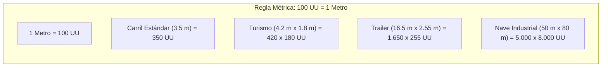
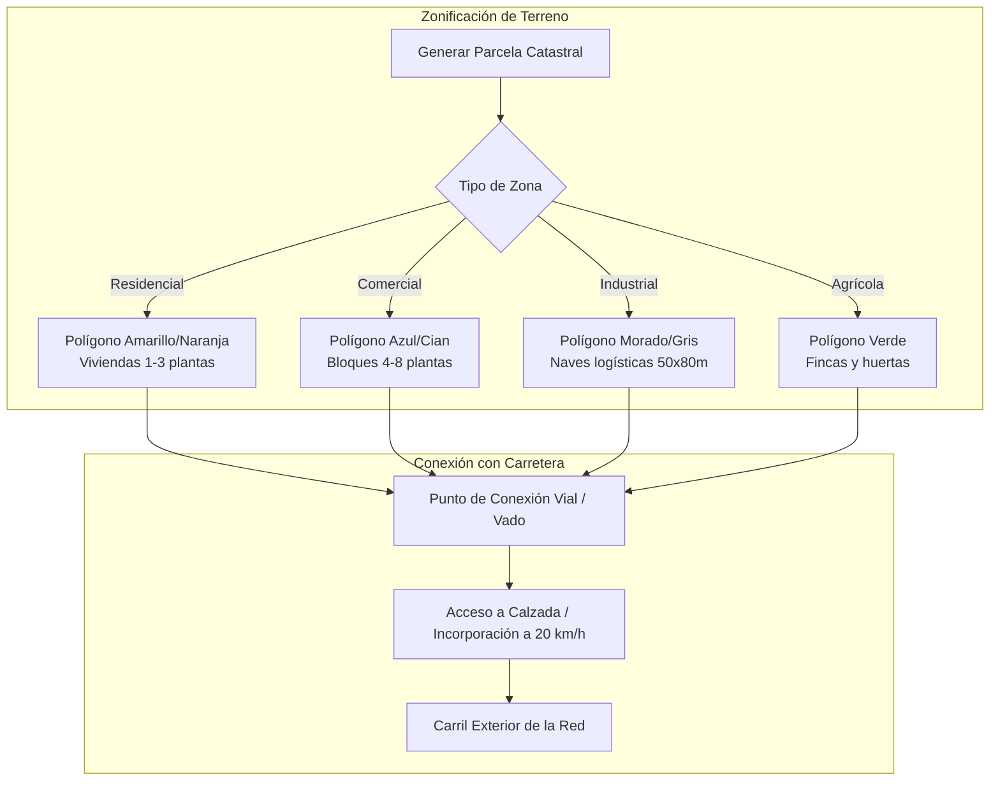

# 05 - Escala Métrica Oficial, Modelado 3D desde Cero y Sistema de Edificios/Parcelas
## Proyecto "Autopistas de España"

Este documento fija la **Escala Métrica Unificada (World Scale)** para todos los assets, el pipeline de modelado 3D propio desde cero para vehículos y elementos del paisaje, el sistema de accesos a parcelas y la evolución de edificios (desde polígonos volumétricos hasta arquitectura realista española).

---

## 1. La Escala Métrica Unificada del Proyecto (World Scale)

Para que las físicas de frenado, los giros, las sombras de los viaductos y las proporciones visuales sean 100% realistas en la vista cenital, se establece una relación directa y estricta:

$$\mathbf{1\text{ Unreal Unit (UU)} = 1\text{ centímetro (cm)} = 0.01\text{ metros (m)}}$$

### 1.1. Tabla Maestra de Dimensiones en Unreal Units (UU)

#### Vías e Infraestructuras (Norma 3.1-IC):
- **Ancho de Carril:** $350\text{ UU}$ ($3.50\text{ m}$).
- **Arcén Exterior de Autovía:** $250\text{ UU}$ ($2.50\text{ m}$).
- **Arcén Interior de Autovía:** $100\text{ UU}$ ($1.00\text{ m}$).
- **Mediana Central:** $200\text{ UU}$ a $400\text{ UU}$ ($2.0\text{ m}$ a $4.0\text{ m}$).
- **Calzada Completa de Autovía 2x2 (con mediana y arcenes):**
  $$W_{\text{autovía}} = (250 + 350 + 350 + 100) \times 2 + 200 = 2.300\text{ UU}\ (23.0\text{ metros})$$
- **Gálibo Libre bajo Puentes / Viaductos:** $550\text{ UU}$ ($5.50\text{ metros}$ de altura libre obligatoria).
- **Distancia entre Pilares de Puente:** $2.500\text{ UU} - 3.500\text{ UU}$ ($25 - 35\text{ metros}$).

#### Vehículos Propios (Creados desde 0):
| Vehículo | Longitud ($X$) | Anchura ($Y$) | Altura ($Z$) | Distancia entre Ejes (Wheelbase) |
| :--- | :--- | :--- | :--- | :--- |
| **Turismo Compacto** | $420\text{ UU}$ ($4.2\text{ m}$) | $180\text{ UU}$ ($1.8\text{ m}$) | $145\text{ UU}$ ($1.45\text{ m}$) | $260\text{ UU}$ ($2.60\text{ m}$) |
| **Berlina / Sedán** | $470\text{ UU}$ ($4.7\text{ m}$) | $185\text{ UU}$ ($1.85\text{ m}$) | $145\text{ UU}$ ($1.45\text{ m}$) | $285\text{ UU}$ ($2.85\text{ m}$) |
| **SUV / Todocamino** | $450\text{ UU}$ ($4.5\text{ m}$) | $190\text{ UU}$ ($1.90\text{ m}$) | $165\text{ UU}$ ($1.65\text{ m}$) | $270\text{ UU}$ ($2.70\text{ m}$) |
| **Motocicleta** | $215\text{ UU}$ ($2.15\text{ m}$) | $85\text{ UU}$ ($0.85\text{ m}$) | $120\text{ UU}$ ($1.20\text{ m}$) | $145\text{ UU}$ ($1.45\text{ m}$) |
| **Furgoneta de Reparto** | $580\text{ UU}$ ($5.8\text{ m}$) | $205\text{ UU}$ ($2.05\text{ m}$) | $230\text{ UU}$ ($2.30\text{ m}$) | $360\text{ UU}$ ($3.60\text{ m}$) |
| **Autobús Interurbano** | $1.350\text{ UU}$ ($13.5\text{ m}$) | $255\text{ UU}$ ($2.55\text{ m}$) | $330\text{ UU}$ ($3.30\text{ m}$) | $700\text{ UU}$ ($7.00\text{ m}$) |
| **Camión Rígido (2 ejes)** | $900\text{ UU}$ ($9.0\text{ m}$) | $250\text{ UU}$ ($2.50\text{ m}$) | $360\text{ UU}$ ($3.60\text{ m}$) | $520\text{ UU}$ ($5.20\text{ m}$) |
| **Camión Articulado + Trailer** | $1.650\text{ UU}$ ($16.5\text{ m}$) | $255\text{ UU}$ ($2.55\text{ m}$) | $400\text{ UU}$ ($4.00\text{ m}$) | Pivote articulado a $450\text{ UU}$ de cabina |
| **Patrulla Guardia Civil / Ambulancia** | $480\text{ UU}$ ($4.8\text{ m}$) | $190\text{ UU}$ ($1.90\text{ m}$) | $185\text{ UU}$ ($1.85\text{ m}$) con puente luces | $285\text{ UU}$ ($2.85\text{ m}$) |

---

## 2. Pipeline de Modelado 3D desde Cero (Assets Propios)

Para no depender de librerías externas genéricas y conseguir una estética coherente, todos los modelos se diseñan desde cero siguiendo especificaciones precisas para vista cenital.

### 2.1. Optimización para Vista Cenital (Top-Down LODs):
- **Techo y Laterales Prioritarios:** En vista cenital, el techo, capó, maletero y laterales superiores concentran el 85% de los píxeles visibles. Los bajos del coche y suspensión apenas se ven, lo que ahorra miles de polígonos.
- **Topología Ligera (Low-to-Mid Poly):**
  - Turismos: 1.200 a 2.500 triángulos por vehículo en LOD0.
  - Camiones: 3.500 triángulos en LOD0.
  - LOD1 (Zoom medio): 400 triángulos.
  - LOD2 (Zoom estratégico lejano): Malla plana de 12 triángulos con textura proyectada (impostor/sprite 3D).

### 2.2. Sistema de Daños y Rotura de Vehículos (Debris & Partes Sueltas):
Cada modelo propio se diseña con subpiezas separables para cuando ocurra un accidente:
1. **Chasis Principal:** Se deforma mediante vértices desplazados o morph targets de impacto frontal/lateral.
2. **Piezas Desprendibles:**
   - Paragolpes delantero y trasero.
   - Capó arrugado que se levanta.
   - Ruedas que se desprenden y ruedan solas por la calzada.
   - Cristales rotos (partículas de vidrio templado en el asfalto).
3. **Restos en Calzada (Debris Obstacles):** Los trozos de chapa caídos quedan como obstáculos en la carretera hasta que la grúa o brigada de limpieza los retira; los coches que pasan por encima deben esquivarlos o sufren pinchazos de ruedas.

---

## 3. Sistema de Edificios y Zonificación (De Polígonos a Detalle)

Tal y como se ha definido, al inicio los edificios se implementan como **polígonos extruidos ligeros** con códigos de color funcionales, permitiendo simular mapas gigantescos con miles de estructuras sin saturar la memoria ni el procesador.

### 3.1. Dimensiones de las Parcelas y Polígonos de Edificios:
1. **Zona Residencial Baja (Pueblos / Chalets):**
   - Parcela: $20\text{ m} \times 30\text{ m}$ ($2.000 \times 3.000\text{ UU}$).
   - Volumen extruido: Altura $600\text{ UU}$ ($6\text{ m}$, 2 plantas) con tejado a dos aguas en teja árabe.
   - Generación de viajes: 2 a 4 turismos por parcela.
2. **Zona Residencial Alta / Ensanche Urbano:**
   - Parcela: $40\text{ m} \times 40\text{ m}$ ($4.000 \times 4.000\text{ UU}$).
   - Volumen extruido: Altura $1.800\text{ UU} - 2.500\text{ UU}$ (6 a 8 plantas, bloques de pisos con patio interior típico de ciudades españolas).
   - Generación de viajes: 40 a 80 turismos + línea de autobús urbano.
3. **Zona Industrial y Parques Logísticos (Fábricas):**
   - Parcela: $60\text{ m} \times 100\text{ m}$ ($6.000 \times 10.000\text{ UU}$).
   - Volumen extruido: Naves diáfanas de altura $900\text{ UU}$ ($9\text{ m}$), muelles de carga para trailers y aparcamientos perimetrales.
   - Generación de viajes: 15 a 30 camiones articulados por día in-game + turnos de furgonetas.

---

## 4. Sistema de Acceso a Parcelas (Driveways & Incorporaciones)

Una ciudad no funciona si los edificios están aislados de la calzada:

1. **Detección Automática de Frente de Fachada:**
   - Cada parcela proyecta un vector hacia el segmento de carretera más cercano.
   - Si la carretera está a menos de $40\text{ metros}$ ($4.000\text{ UU}$), se traza automáticamente una **Vía de Acceso (Vado/Entrada)**.
2. **Comportamiento del Tráfico al Entrar / Salir:**
   - Al salir de la parcela, el vehículo frena a $20\text{ km/h}$, busca un hueco en el carril exterior respetando la prioridad y se incorpora acelerando suavemente.
   - Si la carretera principal es una **autovía**, está **prohibido el acceso directo** a parcelas; el jugador debe construir obligatoriamente una **Vía de Servicio paralela** o un ramal con enlace.

---

## 5. Creación de Paisajes y Biomas Ibéricos

El terreno se genera con mallas de altura (`Landscape` o mallas procedurales `UProceduralMeshComponent`) respetando la escala métrica:

- **Bioma Meseta / Centro Peninsular:** Terrenos llanos u ondulados, colores tierra arcillosa y ocre, campos de cultivo cuadriculados y encinas aisladas.
- **Bioma Mediterráneo / Levante:** Montañas escarpadas próximas a la costa, ramblas secas que exigen viaductos para evitar riadas en temporales, pinares y huertas.
- **Bioma Cantábrico / Norte:** Valles profundos, prados verdes, llovizna frecuente y puertos de montaña escarpados con necesidad obligatoria de túneles y muros de contención de hormigón.
