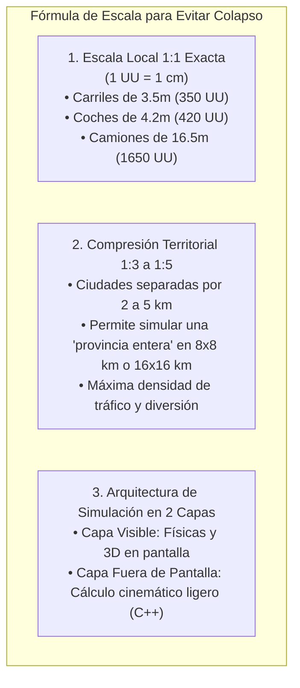

# 06 - Análisis de Escala Óptima para Evitar el Colapso y Nuevas Mecánicas Avanzadas
## Proyecto "Autopistas de España"

Este documento responde técnicamente a la pregunta crítica: **¿Cómo conseguir una escala realista sin saturar la memoria ni colapsar la CPU con miles de vehículos?** Además, detalla un conjunto de mecánicas adicionales que enriquecen la profundidad estratégica del juego.

---

## 1. La Escala Óptima de Rendimiento: "Escala 1:1 Local con Compresión Territorial"

En simuladores de infraestructura vial de éxito (como *Cities: Skylines* o *Transport Fever*), el mayor error es intentar recrear las distancias interurbanas a escala geográfica real (ej. 70 km de campo vacío entre Madrid y Toledo exigirían mapas de 70.000.000 de unidades, con miles de kilómetros de asfalto sin juego).

### 1.1. La Regla de Oro del Proyecto

### 1.2. ¿Por qué este enfoque NO colapsa tu PC?
1. **Evita la pérdida de precisión de coordenadas:** Unreal Engine 5 utiliza *Large World Coordinates (LWC)* en 64 bits, por lo que un mapa de $16\times 16\text{ km}$ ($1.600.000\text{ UU}$) no tiene ningún problema de precisión ni temblor en las mallas.
2. **Renderizado Instanciado en GPU (ISM / Nanite):**
   - Aunque haya 15.000 turismos en el mapa, si todos comparten 4 o 5 modelos base que creamos desde cero, se envían a la tarjeta gráfica mediante **GPU Instancing (1 solo Draw Call)**. La tarjeta gráfica AMD RX 6650 XT los dibuja sin pestañear.
3. **Simulación Desacoplada del Renderizado:**
   - Solo los vehículos dentro del cono de visión de la cámara cenital ejecutan físicas completas de colisión visual y ruedas.
   - Los vehículos que están al otro lado del mapa se mueven mediante una **ecuación matemática en C++ a lo largo del spline**, consumiendo menos del 1% de la CPU Ryzen 5 5600X.

---

## 2. Nuevas Características de Gran Valor Propuestas

A continuación se detallan 6 mecánicas innovadoras inspiradas en la realidad de las carreteras españolas que puedes agregar al diseño:

---

### 2.1. Modo "Obras en Vivo y Desvíos Provisionales"
En la vida real, no puedes demoler y rehacer una autovía de repente con 3.000 coches encima:
- **Gestión de Obras con Conos y Balizas:**
  - Si quieres ampliar un carril o reparar el firme, debes activar el modo obras.
  - El tramo en obras se baliza automáticamente con conos amarillos reflectantes.
  - La velocidad se reduce por normativa a $60\text{ km/h}$ o $80\text{ km/h}$.
  - Se puede habilitar un **Transfer (By-pass)**: desviar un carril hacia la calzada contraria compartiendo la mediana con señales provisionales de obra.

---

### 2.2. Áreas de Servicio Españolas y Descanso de Camioneros (Tacógrafo)
Los conductores no son máquinas incansables:
- **El Típico "Restaurante de Carretera" y Gasolinera:**
  - Construcción de estaciones de servicio en los márgenes de autovías y nacionales con aparcamiento para camiones, gasolinera y cafetería.
- **Mecánica del Tacógrafo Obligatorio:**
  - Por normativa europea, los camiones deben detenerse a descansar 45 minutos cada 4 horas y media de conducción.
  - Si no construyes suficientes áreas de descanso, los camioneros sufren **fatiga y microsueños**, disparando la probabilidad de accidentes graves por salida de vía o tijera en la calzada.
- **Ingresos Extras:** El jugador cobra un canon por cada litro de combustible repostado en su red.

---

### 2.3. Estaciones de Peaje Troncales vs Arcos Free-Flow (Via-T)
Evolución tecnológica de la recaudación:
- **Peaje Tradicional (Cabinas con Barrera):**
  - Económico de construir, pero cada coche debe detenerse a coger ticket o pagar. En horas punta provoca colas monumentales de varios kilómetros.
- **Pórticos Telepeaje "Via-T" (Free-Flow):**
  - Arcos metálicos sobre la calzada con cámaras de lectura de matrícula y antenas de telepeaje. Los coches cruzan a $120\text{ km/h}$ sin reducir la velocidad, cobrando el importe de forma automática y eliminando los atascos en el peaje.

---

### 2.4. Transportes Especiales y Convoyes Pesados
Eventos dinámicos que desafían el diseño de tus carreteras:
- **Aparición Periódica de Convoyes Excepcionales:**
  - Camiones de 60 metros transportando palas de aerogeneradores eólicos hacia parques en las montañas, transformadores eléctricos o vigas colosales para puentes.
  - Van escoltados por vehículos de apoyo con rotativos amarillos y Guardia Civil a $40\text{ km/h}$, ocupando carril y medio.
  - Si tus rotondas o curvas son demasiado cerradas ($R < R_{\min}$), el convoy quedará encallado, bloqueando toda la carretera hasta que rediseñes la intersección.

---

### 2.5. Fauna Ibérica, Vallas Cinegéticas y Pasos de Fauna (Ecoductos)
Protección ambiental y prevención de choques en zonas rurales y montes:
- **Peligro de Atropellos:** En zonas boscosas (ciervos, jabalíes), los animales invaden la calzada de noche, causando siniestros violentos.
- **Solución del Jugador:**
  - Instalar **vallas metálicas cinegéticas** en los márgenes de la autovía para impedir el paso.
  - Construir **Pasos de Fauna Elevados (Ecoductos)**: puentes verdes cubiertos de tierra y arbustos que cruzan por encima de la autopista, permitiendo a la fauna cruzar sin peligro y ganando puntos de aprobación ecológica y fondos de la Unión Europea.

---

### 2.6. Contaminación Acústica y Pantallas Antirruido
Gestión del impacto urbano en los municipios:
- Si una autovía de gran capacidad cruza pegada a una ciudad o pueblo, el nivel de decibelios supera los límites legales.
- Los vecinos protestan, bajan los impuestos municipales y cae la satisfacción ciudadana.
- **Herramienta:** Colocación de **Pantallas Acústicas** (paneles modulares de hormigón fonoabsorbente o metacrilato transparente) a lo largo del arcén para absorber el ruido y calmar las protestas vecinales.

---

### 2.7. Modo "Cámara en Coche" (Cinematic Follow)
Aunque el juego se diseña con vista cenital táctica, el jugador puede:
- Hacer click en cualquier turismo, moto, autobús o camión del mapa.
- La cámara se ancla cenitalmente sobre el vehículo a baja cota ("Cámara de Seguimiento Dinámica").
- Permite ver en primera fila cómo cambia de carril, frena ante un atasco, paga en el peaje o esquiva un obstáculo en la calzada, aportando un factor de satisfacción visual enorme.
