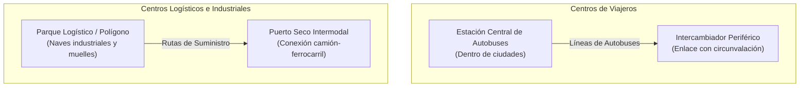
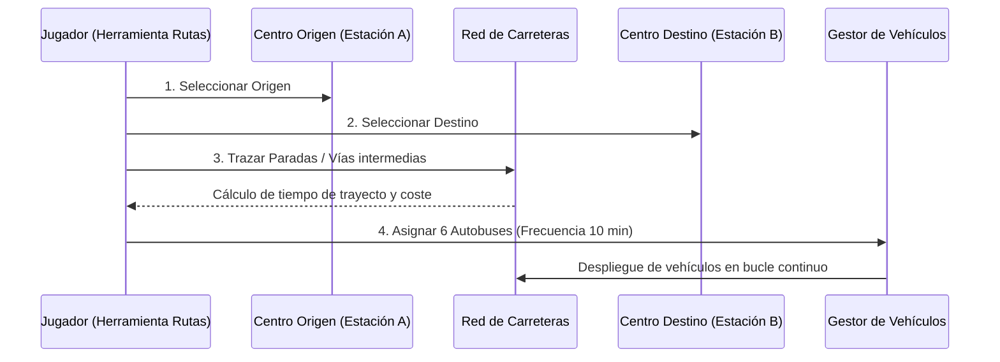
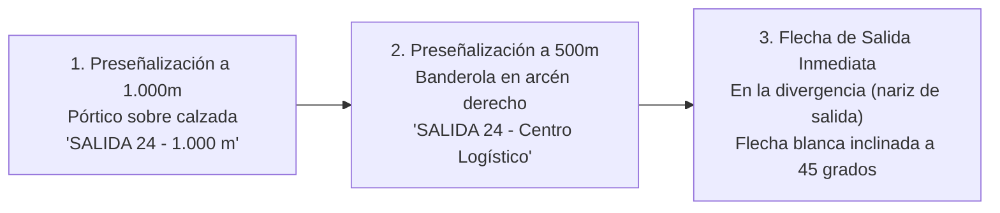

# 07 - Centros de Transporte, Gestión de Rutas y Señalización Vial Realista
## Proyecto "Autopistas de España"

Este documento especifica la creación procedural y gestión de centros de transporte (pasajeros y mercancías), el sistema para trazar líneas de autobuses y camiones, y los elementos de seguridad y señalización vertical hiperrealistas de España (quitamiedos con protección para motoristas, barreras New Jersey y cartelería de salidas).

---

## 1. Centros de Transporte y Nodos Logísticos

Los centros de transporte son edificios singulares que actúan como generadores y receptores masivos de viajes:

### 1.1. Tipos de Centros Implementados:
1. **Estación Central de Autobuses (Urbana):**
   - Se genera proceduralmente en el núcleo de ciudades medianas y grandes.
   - Cuenta con dársenas de embarque y genera cientos de viajeros que desean desplazarse a otras urbes sin utilizar el vehículo privado.
2. **Intercambiador de Transporte Periférico:**
   - Situado junto a grandes nudos de autovía con aparcamiento disuasorio (*Park & Ride*).
   - Los ciudadanos aparcan su coche en las afueras y suben al autobús lanzadera para entrar a la ciudad, reduciendo el colapso en los accesos urbanos.
3. **Parque Logístico y Polígono Industrial:**
   - Situado a las afueras, exige conexión directa con autovías o carreteras nacionales con amplios radios de giro para tráilers de 16.5 metros.
4. **Puerto Seco / Plataforma Multimodal:**
   - Centro de transbordo de contenedores marítimos y mercancías entre ferrocarril y carretera.

---

## 2. Herramienta de Gestión de Rutas de Transporte

El jugador puede abrir el panel de **Gestión de Líneas** para crear y optimizar rutas de transporte público y logístico:

### 2.1. Parámetros de Configuración de la Línea:
- **Flota Asignada:** Número de vehículos operando simultáneamente en la línea.
- **Frecuencia de Salida:** Tiempo in-game entre un vehículo y el siguiente (ej. cada 5, 10 o 15 minutos).
- **Tarifa del Billete / Flete (€):** Si el billete es asequible, el 70% de los viajeros abandonan el turismo particular para viajar en autobús, **eliminando de golpe miles de coches de la autovía**.

---

## 3. Quitamiedos y Barreras de Seguridad Españolas

En España, las barreras de contención lateral salvan vidas y se rigen por normativas específicas:

| Tipo de Barrera | Material y Estructura | Ubicación Típica | Función y Efecto en Colisión |
| :--- | :--- | :--- | :--- |
| **Bionda Metálica Simple** | Chapa de acero galvanizado con perfil de doble onda sobre postes en C. | Carreteras secundarias y arcén exterior de autovías. | Absorbe impactos de turismos redirigiéndolos a la calzada. Peligrosa para motoristas sin protección. |
| **Bionda con SPM (Protección Motoristas)** | Bionda superior + faldón inferior continuo de chapa lisa (Norma UNE-EN 1317). | Curvas de radio reducido e incorporaciones. | **Evita el impacto contra los postes**, reduciendo la mortalidad de motoristas a cero en salidas de vía. |
| **Bionda Doble con Separador** | Dos filas de biondas montadas espalda con espalda. | Medianas estrechas de autovía. | Evita invasiones de la calzada contraria en impactos oblicuos. |
| **Barrera Rígida New Jersey** | Muro continuo de hormigón armado de perfil asimétrico (80 cm de altura). | Medianas de autovías de alta intensidad de tráfico ($>50.000$ veh/día). | Infranqueable para turismos e incluso camiones medianos, eliminando choques frontales al 100%. |

---

## 4. Señalización Vertical y Cartelería de Salidas (Norma 8.1-IC)

Las señales no son adornos; informan a la IA de los vehículos para que preparen el cambio de carril antes de una bifurcación:

### 4.1. Tipos de Carteles Viales Propios:
1. **Pórticos de Autovía (Fondo Azul RAL 5017):**
   - Estructura metálica de celosía que sobrevuela toda la calzada.
   - Muestra el nombre de la vía (ej. `A-4`, `AP-7`), destinos principales y flechas verticales sobre cada carril.
2. **Carteles de Salida Inmediata:**
   - Situados en la isleta cebreada donde se bifurca el ramal de deceleración.
   - Tienen forma rectangular con fondo azul o blanco (si conecta con carretera convencional) y el pictograma oficial de salida.
3. **Hitos Kilométricos (Mojones):**
   - Hitos rojos en Carreteras Nacionales (`N-VI`, `N-340`).
   - Hitos azules en Autovías (`A-1`, `A-2`).
   - Hitos verdes y amarillos en carreteras autonómicas y provinciales.
