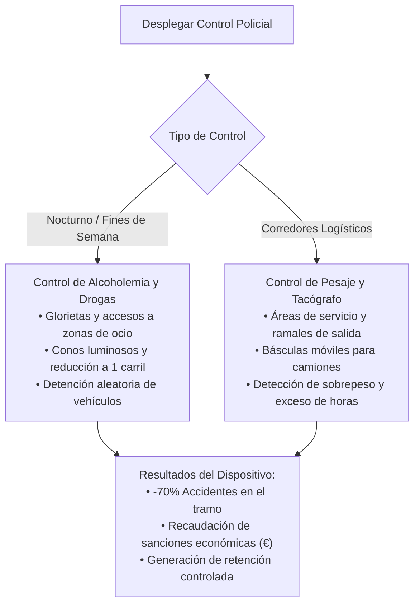
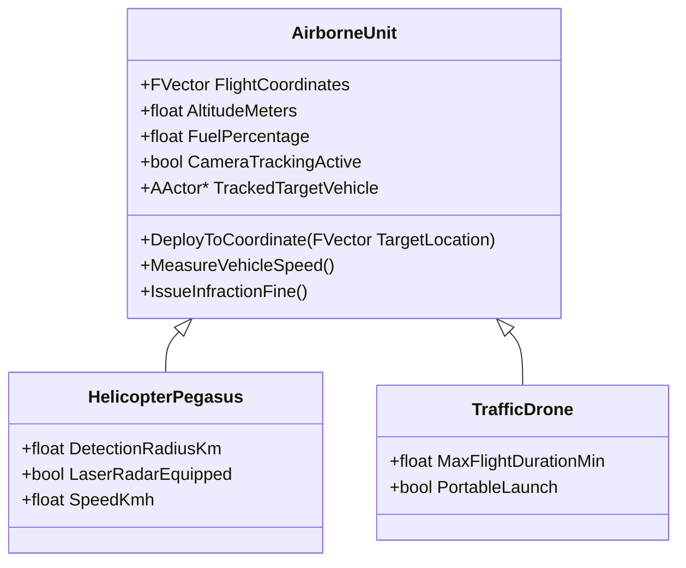

# 08 - Simulación DGT: Controles en Calzada, Guardia Civil y Helicóptero Pegasus
## Proyecto "Autopistas de España"

Este documento detalla la simulación activa de la Dirección General de Tráfico (DGT) y la Agrupación de Tráfico de la Guardia Civil, incluyendo controles estáticos de alcoholemia y drogas, pesaje de camiones y la patrulla aérea con el helicóptero radar "Pegasus".

---

## 1. Operativos y Controles Estáticos de la Guardia Civil

El jugador puede planificar y desplegar controles de tráfico en puntos estratégicos de la red viaria para reducir la accidentalidad o sancionar infracciones graves:

### 1.1. Balizamiento y Efecto en la Calzada:
- **Dispositivo Físico en Pantalla:**
  - Furgoneta de atestados blanca y verde de la Guardia Civil con rotativos azules encendidos en el arcén.
  - Hilera de conos naranjas fluorescentes que estrechan una calzada de 2 o 3 carriles a un solo carril de paso lento ($20\text{ km/h}$).
  - Panel luminoso portátil: `"ALTO POLICÍA - CONTROL DE TRÁFICO"`.
- **Efecto de la Simulación:**
  - Los vehículos reducen la marcha con antelación.
  - Un porcentaje de coches es apartado a la dársena para prueba de alcohol/drogas. Los conductores ebrios son inmovilizados, retirando un peligro mortal de la vía.

---

## 2. Patrulla Aérea: El Helicóptero Radar "Pegasus" y Drones DGT

La vigilancia aérea permite controlar cientos de kilómetros de autovía en cuestión de minutos sin depender de patrullas en tierra.

### 2.1. Mecánica de Juego con Pegasus:
1. **Modo Automático (Patrulla de Tramo):**
   - El jugador asigna una autovía o carretera nacional conflictiva como ruta de vuelo.
   - El helicóptero sobrevuela la vía a $300\text{ metros}$ de altitud cenital proyectando un haz de detección visual.
   - La presencia del helicóptero provoca un **efecto disuasorio inmediato**: el 95% de los conductores reduce la velocidad al límite legal ($120\text{ km/h}$).
2. **Modo Manual (Operador de Cámara Aérea):**
   - El jugador puede hacer click en el helicóptero y activar la **Cámara Giroestabilizada Cenital**.
   - Con el cursor, puede fijar la mira sobre un vehículo sospechoso:
     - El radar calcula la velocidad instantánea y media durante 3 segundos.
     - Detecta infracciones graves: excesos de más de $150\text{ km/h}$, no guardar distancia de seguridad (acoso por alcance) y camiones adelantando en continua.
     - Pulsar el botón **"Sancionar"** emite una multa electrónica al infractor, ingresando dinero al balance de seguridad vial y restando puntos de su perfil de conductor.

### 2.2. Drones de Tráfico (Vigilancia Quirúrgica):
- Desbloqueables en hitos intermedios.
- Son más económicos que el helicóptero y se despliegan en rotondas peligrosas o incorporaciones cortas para vigilar distracciones al volante (móvil) y uso indebido del cinturón de seguridad.

---

## 3. Sistema de Infracciones, Sanciones y Puntos

| Infracción Detectada | Gravedad | Sanción Económica | Pérdida de Puntos | Impacto en la Red |
| :--- | :--- | :--- | :--- | :--- |
| **Exceso Leve ($121 - 150\text{ km/h}$)** | Leve | 100 € | 0 puntos | Aumenta ligeramente el riesgo de choque por alcance. |
| **Exceso Muy Grave ($> 150\text{ km/h}$)** | Muy Grave | 600 € | 6 puntos | Pérdida de control garantizada en caso de frenada brusca. |
| **Positivo en Alcohol / Drogas** | Muy Grave | 1.000 € | 6 puntos + Inmovilización | Conducción errática con invasión de carriles vecinos. |
| **Camión con Sobrepeso de Carga** | Grave | 2.500 € | N/A a la empresa | Destrozo acelerado del asfalto y frenada defectuosa. |
| **Exceso de Tacógrafo (Conductor fatigado)**| Grave | 1.500 € | Inmovilización 9h | Riesgo crítico de dormirse al volante y volcar. |
