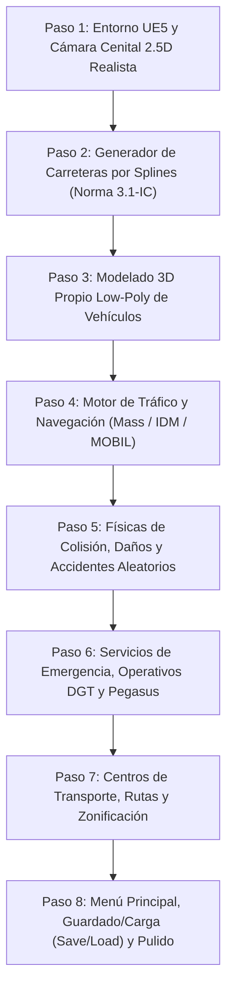

# 09 - Plan de Desarrollo Modular por Pasos (Roadmap de Implementación)
## Proyecto "Autopistas de España"

Este documento desglosa todo el desarrollo del juego en **8 Pasos Secuenciales e Independientes**. Cada paso produce un entregable jugable y verificable en Unreal Engine 5, evitando atascos o sobrecargas de trabajo.

---

## 🗺️ Visión General de los 8 Pasos de Desarrollo

---

## 🛠️ Desglose Detallado Paso a Paso

### 📍 Paso 1: Configuración del Proyecto y Cámara Cenital 2.5D
* **Objetivo:** Tener la base en C++ de Unreal Engine 5 funcionando con controles fluidos de simulación.
* **Tareas Concretas:**
  1. Crear proyecto C++ `AutopistasEspaña` en `C:\app\game_autopista`.
  2. Implementar `AAutopistasTopDownCamera` con movimiento suave (WASD, ratón al borde) y zoom continuo con rueda de ratón (de vista cercana con detalle a vista lejana estratégica).
  3. Configurar iluminación cenital PBR (sol directo con sombras nítidas y cielo despejado).
* **Entregable Verificable:** Un mapa plano donde el jugador puede moverse con el ratón y hacer zoom fluidamente a 60+ FPS.

---

### 📍 Paso 2: Generador de Carreteras por Splines y Mallas Procedurales
* **Objetivo:** Poder trazar carreteras de 1, 2 y 3 carriles con el ratón sobre el suelo.
* **Tareas Concretas:**
  1. Crear la clase `URoadSplineComponent` con el perfil transversal de la calzada (anchos de carril de 3.5m, arcenes y mediana).
  2. Implementar generación procedural de asfalto, marcas viales continuas/discontinuas (Norma 8.2-IC) y biondas metálicas (quitamiedos).
  3. Detección de elevación: Si $Z > 3\text{m}$, colocar viaducto con pilas de hormigón automáticas; si $Z < -3\text{m}$, generar boca de túnel.
  4. Algoritmo de unión de rotondas y ramales de incorporación.
* **Entregable Verificable:** El jugador hace click-drag en el suelo y construye carreteras, rotondas y puentes elevados conectados entre sí.

---

### 📍 Paso 3: Modelado 3D Propio Low-Poly de Vehículos y Texturizado
* **Objetivo:** Crear los modelos 3D propios desde cero optimizados para vista cenital según la escala oficial ($1\text{ UU} = 1\text{ cm}$).
* **Tareas Concretas:**
  1. Modelar los 5 arquetipos base: Turismo ($420\times 180\text{ UU}$), Motocicleta ($215\times 85\text{ UU}$), Furgoneta ($580\times 205\text{ UU}$), Autobús ($1350\times 255\text{ UU}$) y Trailer articulado ($1650\times 255\text{ UU}$).
  2. Crear variantes de piezas desprendibles: paragolpes suelto, capó doblado y ruedas desprendidas.
  3. Materiales de pintura PBR con colores variados y faros con luces emisivas para la noche.
* **Entregable Verificable:** Modelos importados en el proyecto con LODs y jerarquía de componentes listos para el motor de tráfico.

---

### 📍 Paso 4: Motor de Tráfico y Conducción Masiva (IDM + MOBIL)
* **Objetivo:** Poner miles de coches a circular de forma inteligente respetando las normas de tráfico de España.
* **Tareas Concretas:**
  1. Crear el grafo dirigido de carriles (`FLaneGraph`).
  2. Implementar el algoritmo **IDM (Intelligent Driver Model)** en C++ para mantener distancia de seguridad y frenar suavemente.
  3. Implementar **MOBIL** adaptado a España: adelantar obligatoriamente por la izquierda y retornar de inmediato al carril derecho.
  4. Lógica de ceda el paso y prioridad absoluta en glorietas.
* **Entregable Verificable:** Cientos de vehículos circulan por las carreteras construidas en el Paso 2 sin atravesarse entre sí.

---

### 📍 Paso 5: Físicas de Colisión, Daños y Accidentes Aleatorios
* **Objetivo:** Simular siniestros reales con impacto físico, bloqueo de carriles y restos en el asfalto.
* **Tareas Concretas:**
  1. Detección de impactos mediante cajas OBB cinemáticas.
  2. Generador estocástico de averías aleatorias (pinchazos a 120 km/h o coches parados con avería).
  3. En caso de choque: los vehículos se detienen, se deforman, desprenden piezas en el suelo y marcan el carril como **BLOQUEADO**.
  4. Lógica de retención y "efecto mirón" en el tráfico adyacente.
* **Entregable Verificable:** Un choque provoca el corte de un carril de la autovía y genera una cola de tráfico realista que retrocede en el tiempo.

---

### 📍 Paso 6: Servicios de Emergencia, Operativos DGT y Helicóptero Pegasus
* **Objetivo:** Gestionar el restablecimiento de la red y el control policial activo.
* **Tareas Concretas:**
  1. Despliegue de unidades de rescate (Guardia Civil, Ambulancia 061 y Grúa).
  2. Comportamiento de "Pasillo de Emergencia" (los coches se abren a los lados para dejar pasar a las sirenas).
  3. Retirada de vehículos siniestrados y limpieza de restos de calzada para reabrir la vía.
  4. Herramienta para desplegar controles de alcoholemia/pesaje con conos.
  5. Unidad aérea **Pegasus**: patrulla con radar cenital y emisión de multas por exceso de velocidad.
* **Entregable Verificable:** La grúa acude a la zona del siniestro, engancha los vehículos rotos y reabre la autovía; el jugador puede pilotar la cámara de Pegasus y multar infractores.

---

### 📍 Paso 7: Centros de Transporte, Rutas y Zonificación de Edificios
* **Objetivo:** Dar propósito a los viajes conectando ciudades, industrias y transporte público.
* **Tareas Concretas:**
  1. Generador procedural de polígonos de edificios (residenciales amarillos, comerciales azules, naves industriales moradas).
  2. Conexión de accesos viales (vados) entre parcelas y carreteras.
  3. Centros de transporte: Estación Central de Autobuses y Plataforma Logística de Carga.
  4. Herramienta de Creación de Líneas de Autobuses y Rutas de Suministro de Camiones.
* **Entregable Verificable:** Las ciudades demandan viajes entre sí; el jugador crea una línea de autobús y comprueba cómo desciende el número de coches particulares en la autovía.

---

### 📍 Paso 8: Menús, UI, Guardado/Carga (Save/Load) y Pulido Visual
* **Objetivo:** Cerrar el ciclo de juego comercial con interfaz profesional y persistencia de partidas.
* **Tareas Concretas:**
  1. Menú principal con fondo cenital 3D dinámico de una autopista en funcionamiento.
  2. Asistente de configuración de nueva partida sandbox (tamaño de mapa, orografía, dificultad).
  3. Sistema de guardado y carga en C++ con ranuras múltiples, guardado rápido (`F5/F9`), autoguardado y reinicio de mapa.
  4. HUD completo: Fondos (€), medidor de congestión, reloj de 24 horas y selector de herramientas viales.
* **Entregable Verificable:** El jugador puede guardar su partida, salir al menú, volver a cargarla exactamente como la dejó o reiniciar el mapa desde cero.
