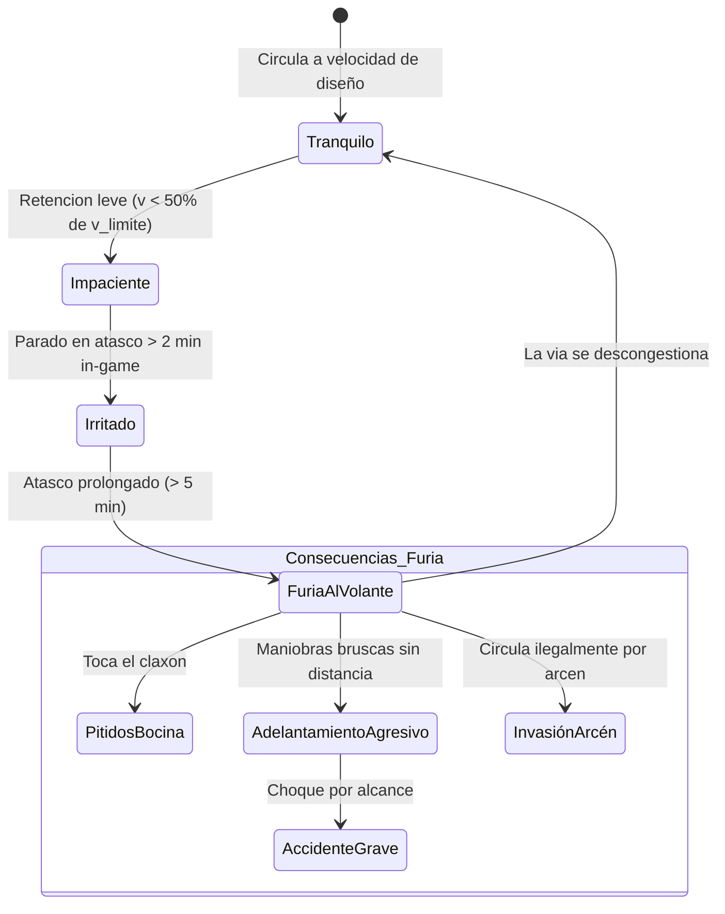

# 10 - Sistema de Tiempo de Obra e Impacto Constructivo y Psicología del Conductor
## Proyecto "Autopistas de España"

Este documento especifica dos mecánicas clave que añaden realismo y desafío estratégico a la gestión vial:
1. **El Tiempo de Construcción Realista y su Impacto en el Tráfico (activable/desactivable en ajustes)**.
2. **El Sistema de Humor, Frustración y Furia al Volante (*Road Rage*) de los Conductores**.

---

## 1. Sistema de Tiempo de Obra e Impacto Constructivo

En la vida real, una autovía o un puente no aparecen por arte de magia al hacer clic con el ratón. Requieren semanas o meses de obras que alteran la circulación circundante.

```mermaid
graph TD
    AccionJugador["Jugador Trazar Nueva Carretera / Ampliacion"] --> CheckAjustes{"Ajustes:<br/>¿Tiempo de Obra Activo?"}
    CheckAjustes -->|Desactivado (Modo Rapido)| Instantanea["Construccion Instantanea<br/>(Abierta de inmediato)"]
    CheckAjustes -->|Activado (Modo Realista)| EnObras["Fase de Obra con Maquinaria"]

    EnObras --> Fase1["1. Movimiento de Tierras (30% tiempo)<br/>• Desmonte y terraplen con excavadoras"]
    Fase1 --> Fase2["2. Extendido y Asfaltado (50% tiempo)<br/>• Extendedoras y rodillos compactadores"]
    Fase2 --> Fase3["3. Pintura y Biondas (20% tiempo)<br/>• Marcas viales y quitamiedos"]
    Fase3 --> Inauguracion["Carretera Abierta al Trafico"]
```

### 1.1. Configuración en el Menú de Ajustes:
- **Parámetro:** `Modo de Construcción` $\rightarrow$ `[ Instantáneo ]` / `[ Con Tiempo de Obra ]`.
- **Velocidad de Obra:** Configurable entre *Rápida* (15 segundos in-game por km de carretera) o *Realista* (días del calendario in-game).

### 1.2. Impacto en la Red Durante la Obra:
1. **Carretera Nueva en Campo Libre:** No afecta a las vías existentes hasta que se conecta el nudo de enlace.
2. **Ampliación de Carriles o Reparación de Autovía Existente:**
   - Corta el carril afectado mediante **conos de obra amarillos reflectantes**.
   - Reduce el límite de velocidad legal de $120\text{ km/h}$ a $60\text{ km/h}$ o $80\text{ km/h}$.
   - **Efecto Embudo (Botleneck):** Si una autovía 2x2 pierde un carril por obras, la capacidad cae un 55%, provocando retenciones que ponen a prueba la paciencia de los conductores.

---

## 2. Psicología del Conductor y Sistema de Humor / Frustración

Los vehículos no son robots inmunes al estrés. Cada conductor posee un **Índice de Frustración ($0 - 100\%$)** y un **Nivel de Humor** que evoluciona dinámicamente según las condiciones de la vía:



### 2.1. Fórmula Matemática de la Frustración:
Por cada segundo de simulación, la frustración $F$ del conductor se actualiza:

$$\frac{dF}{dt} = \begin{cases} 
-k_{\text{alivio}} & \text{si } v \ge 0.85 \cdot v_0 \text{ (circulación fluida)} \\
+k_{\text{freno}} \cdot \left(1 - \frac{v}{v_0}\right) & \text{si } 0 < v < 0.85 \cdot v_0 \text{ (tráfico lento)} \\
+k_{\text{atasco}} \times 2.5 & \text{si } v = 0 \text{ (totalmente detenido en atasco)}
\end{cases}$$

### 2.2. Niveles de Humor y Comportamientos en Conducción:

| Nivel de Humor | Rango Frustración | Comportamiento en la Red | Efectos Visuales y Sonoros |
| :--- | :--- | :--- | :--- |
| **1. Tranquilo (Zen)** | $0\% - 25\%$ | Conducción modélica: respeta los $1.4\text{ s}$ de distancia de seguridad IDM, usa intermitentes y cede el paso amablemente. | Sin sonido. Conducción fluida. |
| **2. Impaciente** | $26\% - 50\%$ | Reduce la distancia de seguridad a $0.9\text{ s}$. Busca cambiar al carril izquierdo a la mínima que el coche delantero frena. | Conducción más tensa. |
| **3. Irritado** | $51\% - 75\%$ | Hace ráfagas de luces, se pega a $2\text{ metros}$ del parachoques delantero (acoso vial) y **hace sonar la bocina (claxon)** si alguien tarda en arrancar en una rotonda. | Sonido de claxon audible en vista cenital. |
| **4. Furia al Volante (*Road Rage*)** | $76\% - 100\%$ | **Pérdida de control del conductor:**<br/>• Realiza maniobras de adelantamiento con riesgo inminente de impacto.<br/>• **Invade el arcén exterior** para saltarse la retención (sancionable por la Guardia Civil o radar Pegasus).<br/>• Multiplica por 5 el riesgo de provocar una colisión por alcance en cadena. | Pitidos continuos, volantazos bruscos y humo de neumáticos. |

---

## 3. Impacto en la Gestión y Opinión Pública

El humor de los conductores repercute directamente en la partida:
1. **Satisfacción Ciudadana:** Una red con alta proporción de conductores con furia al volante desploma la aprobación del jugador.
2. **Efecto Avalancha de Siniestros:** Un atasco inicial de 10 minutos irrita a cientos de conductores, lo que desencadena choques secundarios que prolongan el colapso durante horas si el jugador no interviene enviando a la Guardia Civil o abriendo carriles adicionales.
