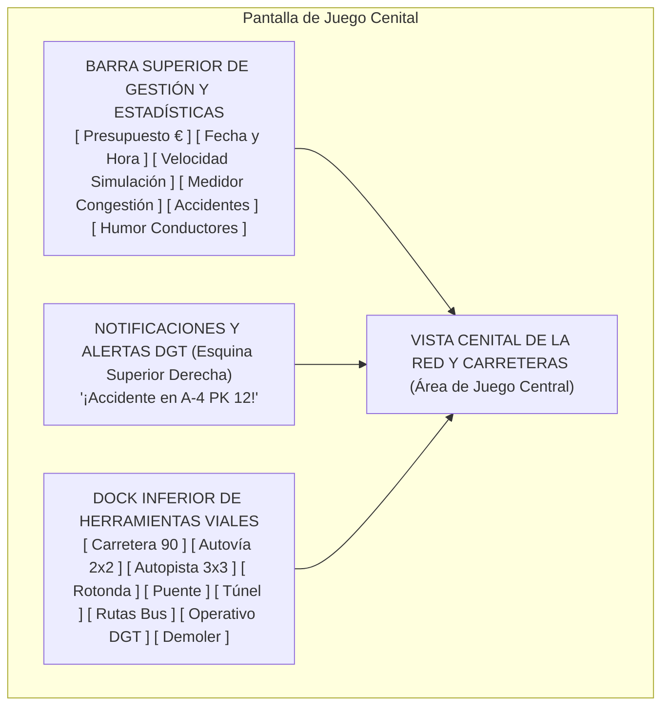
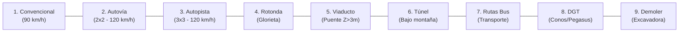

# 11 - Diseño de la Interfaz Gráfica (HUD, Menús y Experiencia de Usuario)
## Proyecto "Autopistas de España"

Este documento especifica la arquitectura visual, layout, paleta de colores oficial de carreteras españolas y flujos de interacción de la Interfaz de Usuario (UI / HUD / UX).

---

## 1. Distribución del HUD en Pantalla (Layout General)

La interfaz se concibe para maximizar la visibilidad del terreno y el tráfico en vista cenital, agrupando los controles en dos áreas principales:

---

## 2. Componentes de la Barra Superior (Top Bar)

La barra superior ofrece toda la información vital del estado de la red sin saturar al jugador:

| Módulo | Elemento Visual | Datos Mostrados | Comportamiento Interactivo |
| :--- | :--- | :--- | :--- |
| **Finanzas** | Icono `€` en verde esmeralda | Saldo disponible (ej. `5.420.000 €`) y variación mensual (`+45.000 €/mes`). | Click abre el desglose financiero (ingresos por peajes vs costes de asfalto y siniestralidad). |
| **Reloj y Tiempo** | Reloj analógico/digital y fecha | Hora del día (`08:30h`) y condición climática (`Soleado`, `Lluvia`, `Niebla`). | Click permite saltar directamente a la noche para obras. |
| **Control Temporal** | Botonera `[ || ] [ > ] [ >> ] [ >>> ]` | Pausa, x1 (Normal), x2 (Rápida), x4 (Ultra). | Teclas de acceso rápido: `Barra Espaciadora`, `1`, `2`, `3`. |
| **Medidor de Congestión**| Barra de color dinámico ($0 - 100\%$) | Porcentaje de retención global de la red viaria. | Verde ($<20\%$), Amarillo ($20-50\%$), Naranja ($50-75\%$), Rojo ($>75\%$). |
| **Siniestralidad Activa** | Triángulo de peligro DGT reflectante | Número de accidentes activos sin resolver (ej. `2 Accidentes`). | **Click centra la cámara instantáneamente** sobre el punto kilométrico del choque. |
| **Humor del Conductor** | Emoji dinámico (Zen $\rightarrow$ Enfado) | Porcentaje de conductores en estado de **Furia al Volante** ($Road Rage$). | Alerta si las colas están alterando el comportamiento de los conductores. |

---

## 3. Dock Inferior de Herramientas de Construcción (Bottom Dock)

Inspirado en el diseño moderno de los dockbars flotantes con esquinas redondeadas y fondo oscuro translúcido:

### 3.1. Teclas de Acceso Rápido (Hotkeys):
- `1` a `6`: Selector directo del tipo de calzada a trazar.
- `B`: Alternar herramienta de Puentes (elevar vía).
- `T`: Alternar herramienta de Túneles (hundir vía).
- `R`: Colocar Rotonda paramétrica en intersección.
- `D` o `Supr`: Activar modo Demolición / Excavadora.
- `Escape`: Cancelar herramienta activa y volver al cursor de inspección.

---

## 4. Paleta de Colores Oficial (Inspirada en Señalización Española)

| Color | Código Hex | Referencia Oficial | Uso en la Interfaz |
| :--- | :--- | :--- | :--- |
| **Azul Autovía** | `#0A4874` | Norma 8.1-IC (Azul RAL 5017) | Cabeceras de paneles, iconos de autovías y carteles informativos. |
| **Gris Asfalto Oscuro** | `#1C1C1E` | Pavimento bituminoso | Fondo del HUD, menús translúcidos con efecto desenfoque (*blur*). |
| **Naranja Obras y Radar**| `#FF9500` | Señalización provisional DGT | Botones de control de velocidad, herramientas de obras y conos. |
| **Rojo Retención / Alerta**| `#FF3B30` | Código de Peligro DGT | Avisos de accidentes, atascos críticos e indicador de furia al volante. |
| **Verde Fluido / Euros** | `#34C759` | Verde Autonómico / Señalización | Tráfico fluido, saldo positivo e ingresos económicos. |
| **Blanco Termoplástico** | `#F2F2F7` | Marcas Viales Norma 8.2-IC | Tipografías principales, números e iconos de alto contraste. |

---

## 5. Sistema de Notificaciones Flotantes (Toast Alerts)

Aparecen en la esquina superior derecha con sonido característico:
- **Alerta de Siniestro (Borde Rojo):**
  - *"¡ALERTA 112: Accidente múltiple en A-4 PK 18! Grúa y Guardia Civil en camino. Carril izquierdo cortado."*
- **Alerta Meteorológica (Borde Naranja):**
  - *"AVISO DGT: Se aproxima tormenta con riesgo de aquaplaning. Velocidad recomendada 80 km/h."*
- **Hito Desbloqueado (Borde Dorado):**
  - *"¡NUEVO HITO ALCANZADO: Red de Autovías Desbloqueada! Puedes construir calzadas 2x2 y pasos a distinto nivel."*
