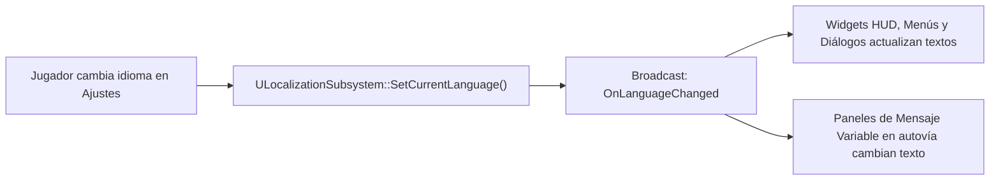

# 12 - Sistema de Localización Bilingüe (Español / Inglés)
## Proyecto "Autopistas de España"

Este documento especifica la arquitectura de internacionalización y traducción dinámica en tiempo real entre **Español (ES)** e **Inglés (EN)** para todos los textos del juego (menús, herramientas, avisos de la DGT, HUD y tutoriales).

---

## 1. Arquitectura del Subsistema de Localización

El sistema utiliza la clase C++ `ULocalizationSubsystem` derivada de `UGameInstanceSubsystem`, lo que permite que el idioma persista entre cambios de mapa y sesiones sin requerir reiniciar el juego:

---

## 2. Tabla Maestra de Cadenas de Texto (String Table ES / EN)

| Clave (Key) | Texto en Español (ES) | Texto en Inglés (EN) | Contexto de Uso |
| :--- | :--- | :--- | :--- |
| `GAME_TITLE` | Autopistas de España | Highways of Spain | Cabecera y Menú Principal |
| `MENU_CONTINUE` | Continuar | Continue | Menú Principal |
| `MENU_NEW_GAME` | Nueva Partida | New Game | Menú Principal |
| `MENU_LOAD_GAME` | Cargar Partida | Load Game | Menú Principal |
| `MENU_SETTINGS` | Ajustes | Settings | Menú Principal y Pausa |
| `MENU_EXIT` | Salir al Escritorio | Exit to Desktop | Menú Principal |
| `TOOL_SELECT` | Inspeccionar | Inspect | Cursor de inspección |
| `TOOL_ROAD_90` | Carretera Convencional (90 km/h) | Conventional Road (90 km/h) | Dock de construcción |
| `TOOL_HIGHWAY_2X2` | Autovía 2x2 (120 km/h) | Dual Carriageway 2x2 (120 km/h)| Dock de construcción |
| `TOOL_HIGHWAY_3X3` | Autopista 3x3 (120 km/h) | Motorway 3x3 (120 km/h) | Dock de construcción |
| `TOOL_ROUNDABOUT` | Glorieta / Rotonda | Roundabout | Dock de construcción |
| `TOOL_VIADUCT` | Viaducto / Puente | Viaduct / Bridge | Dock de construcción |
| `TOOL_TUNNEL` | Túnel de Montaña | Mountain Tunnel | Dock de construcción |
| `TOOL_BUS_LINES` | Líneas de Transporte | Transit Lines | Editor de rutas |
| `TOOL_DGT_CONTROLS` | Operativo DGT / Conos | DGT Police Checkpoint | Despliegue policial |
| `TOOL_PEGASUS` | Patrulla Aérea Pegasus | Pegasus Helicopter Patrol | Vigilancia aérea |
| `TOOL_DEMOLISH` | Demolición | Demolition | Modo demoler |
| `HUD_BUDGET` | Presupuesto | Budget | Barra superior HUD |
| `HUD_CONGESTION` | Congestión | Congestion | Barra superior HUD |
| `HUD_ACCIDENTS` | Accidentes Activos | Active Incidents | Barra superior HUD |
| `HUD_ROAD_RAGE` | Furia al Volante | Road Rage | Barra superior HUD |
| `ALERT_ACCIDENT` | ¡ALERTA 112: Accidente en calzada! Grúa y Guardia Civil en camino. | 112 EMERGENCY: Traffic collision! Tow truck and Highway Patrol dispatched. | Notificación Toast |
| `ALERT_WEATHER_RAIN` | AVISO DGT: Lluvia intensa. Riesgo de aquaplaning. | WEATHER WARNING: Heavy rain detected. Aquaplaning hazard. | Notificación Toast |
| `ALERT_ROAD_JAM` | RETENCIÓN: Vía colapsada. Los conductores están perdiendo los nervios. | TRAFFIC JAM: Severe gridlock. Drivers are getting frustrated. | Notificación Toast |
