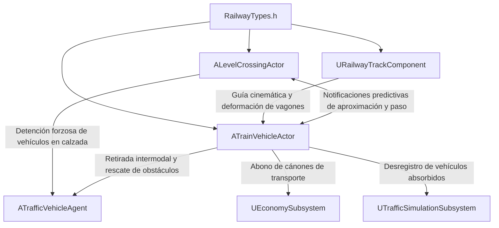

# 14. Sistema Ferroviario, Pasos a Nivel y Autopista Ferroviaria

## "Autopistas de España: Simulador de Infraestructuras y Tráfico"
**Módulo:** Ingeniería Ferroviaria, Pasos a Nivel y Descongestión Modal  
**Ruta:** `Source/AutopistasEspana/Railway/`  
**Normativas de Referencia:** RCF (Reglamento de Circulación Ferroviaria), ADIF NVG (Norma de Vía General), Orden FOM/2835/2015 sobre Pasos a Nivel, Directiva de Intermodalidad y Autopistas Ferroviarias del MITMA.

---

## 1. Visión y Propósito del Módulo Ferroviario

El módulo ferroviario integra la infraestructura de transporte sobre raíles con la red viaria de autovías y carreteras convencionales, con tres objetivos fundamentales:
1. **Modelado Geométrico de Vía Férrea:** Representación continua de balasto de piedra machacada, traviesas monobloque de hormigón pretensado y carriles continuos soldados de acero UIC 60 sobre ancho ibérico (1.668 mm) y estándar internacional.
2. **Seguridad Activa en Pasos a Nivel (PN Clase C - Semibarreras SLA):** Enclavamiento físico y óptico en intersecciones a nivel entre carreteras y vías de tren. Incluye semibarreras abatibles motorizadas, semáforos de doble foco rojo alternante, señal acústica y detección/detención del tráfico rodado.
3. **Autopista Ferroviaria y Descongestión de Autovías:** Trenes de mercancías que retiran camiones pesados y turismos del asfalto mediante vagones plataforma rebajada (tipo Modalohr/Rollende Landstrasse), aliviando el tráfico en autovías saturadas, reduciendo siniestralidad, rebajando emisiones de CO2 y aportando ingresos por cánones intermodales a la economía del juego.

---

## 2. Arquitectura de Archivos y Componentes C++

### 2.1. `RailwayTypes.h`
- **`ETrainType`:**
  - `MercanciasContenedores`: Convoy intermodal para la Autopista Ferroviaria.
  - `CercaniasPasajeros`: Transporte pendular masivo de viajeros.
  - `AltaVelocidadAVE`: Líneas de tráfico rápido de pasajeros.
  - `MantenimientoAuxilio`: Locomotora de talleres ADIF y auxilio en vía.
- **`ELevelCrossingState`:**
  - `Abierto`: Paso libre para carretera, semibarreras verticales a 90°, señales apagadas.
  - `AvisoTrenAproximandose`: Activación de focos rojos parpadeantes y campana acústica ante sensor de vía.
  - `BajandoBarreras`: Rotación motorizada de 90° a 0° de las semibarreras.
  - `Cerrado`: Vía enclavada para paso del tren, bloqueo absoluto del tráfico.
  - `SubiendoBarreras`: Elevación de semibarreras tras libranza de vía.
  - `AveriaEmergencia`: Estado a prueba de fallos (*fail-safe*).
- **`FRailwayTrackConfig`:** Parámetros métricos reglamentarios (ancho 166.8 cm, balasto base 460 cm, altura balasto 38 cm, traviesas cada 60 cm).
- **`FRailwayCargoManifest`:** Contabilidad de camiones y coches retirados, toneladas netas, CO2 ahorrado y canon en Euros.

---

### 2.2. `RailwayTrackComponent` (`.h` / `.cpp`)
- Hereda de `USplineComponent`.
- Método `GenerateTrackMesh(UProceduralMeshComponent* TargetMesh)`:
  - **Sección 0 - Balasto:** Prisma trapezoidal con taludes calculados a 45° y coordenadas UV mapeadas para texturas de balasto granítico.
  - **Sección 1 - Carriles de Acero:** Extrusión simultánea de carril izquierdo y derecho con perfil UIC 60, tangentes suaves y normales precisas.
  - **Sección 2 - Traviesas:** Malla procedural rectangular de traviesas monobloque dispuestas perpendicularmente cada 60 cm.
- Métodos de consulta espacial: `GetRailPositionAtDistance()`, `GetTrackRotationAtDistance()` y cálculo dinámico de peralte reglamentario en curva (`CalculateCurvatureCant()`).

---

### 2.3. `LevelCrossingActor` (`.h` / `.cpp`)
- Representa el cruce a nivel entre un spline de carretera (`URoadSplineComponent`) y una vía férrea (`URailwayTrackComponent`).
- **Mecanismos y Señalización:**
  - Mástiles laterales con brazos abatibles (semibarreras reflectantes en rojo y blanco).
  - Rotación angular suave interpolada de 90° a 0° con velocidad de motor configurable.
  - Focos LED de señalización con parpadeo rojo alternante a 1.5 Hz.
  - Pavimento STRAIL de cruce a nivel con losas de caucho y rampas de transición de asfalto.
- **Enclavamiento y Detención de Tráfico:**
  - `RoadTrafficBlockerBox`: Collider físico que corta el paso a los vehículos.
  - `ManageRoadTrafficStopping()`: Detección proactiva de vehículos en la calzada, desaceleración gradual y parada en la línea de detención reglamentaria.
  - `TrackDangerZoneBox`: Supervisión continua de la zona crítica entre barreras para detectar coches atrapados o averiados.

---

### 2.4. `TrainVehicleActor` (`.h` / `.cpp`)
- Actor del convoy ferroviario guiado sobre el spline de vía férrea.
- **Cinemática y Composición:**
  - Locomotora tractora y hasta $N$ vagones articulados consecutivamente a lo largo de las curvas del spline.
  - Simulación física con inercia de masa ferroviaria (aceleración suave y frenadas progresivas).
  - Detección y supervisión predictiva de pasos a nivel (`MonitorLevelCrossings()`) enviando avisos de aproximación, ocupación y libranza.
- **Retirada de Vehículos de Autovías (Autopista Ferroviaria):**
  - `RemoveHighwayVehicle(ATrafficVehicleAgent* RoadVehicle)`: Transfiere camiones (`CamionTrailer`) a plataformas Modalohr y coches a vagones portacoches.
  - `DecongestParallelHighway()`: Barrido autónomo de autovías paralelas que absorbe vehículos en atasco o camiones lentos, aliviando de inmediato la congestión vial.
  - `ClearBlockedVehiclesAtUpcomingCrossing()`: Rescate y retirada de vehículos atascados en pasos a nivel antes de que llegue el convoy.
  - Integra beneficios directos con `UEconomySubsystem` (+450 € por camión, +95 € por turismo) y actualiza el censo vehicular en `UTrafficSimulationSubsystem`.
