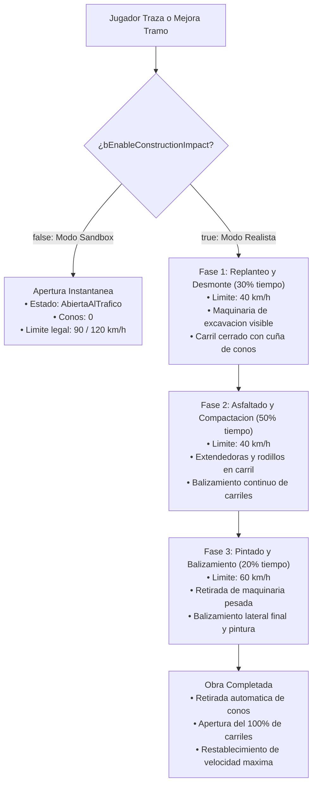
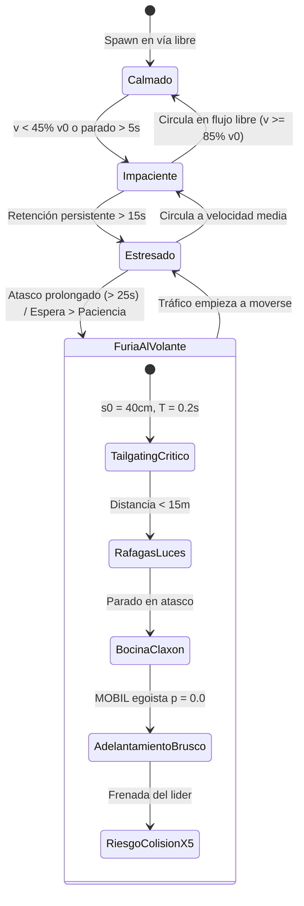

# 15 - Impacto de Obras Viales Temporales y Modelo Psicológico de Conductores
## Proyecto "Autopistas de España" (Unreal Engine 5)

Este documento técnico detalla la arquitectura, modelos matemáticos, comportamiento cinemático e implementación C++ de dos pilares sistémicos clave para la jugabilidad y el realismo de **Autopistas de España**:
1. **El Sistema de Impacto de Obras Temporales conmutable (`bEnableConstructionImpact`)**: fases constructivas, balizamiento reflectante dinámico mediante conos `SM_Cono_Obra_75`, estrechamiento de calzada y reducciones drásticas de velocidad según la normativa de carreteras.
2. **El Modelo Psicológico y Humor de los Conductores (`bEnableDriverFrustration`)**: acumulación de estrés en atascos (`WaitTimeInJam`), estados anímicos progresivos (`ECondicionPsicologica`) y consecuencias conductuales de la **Furia al Volante** (*Road Rage*: acoso trasero / tailgating, ráfagas de luces, adelantamientos agresivos MOBIL con cortesía nula y multiplicación x5 del riesgo de colisión por alcance).

---

## 1. Justificación y Normativa Técnica Española

En la ingeniería de carreteras real, la construcción, reasfaltado o ampliación de un tramo de autovía no es un evento instantáneo. Afecta severamente a la capacidad de la red y genera importantes alteraciones en la conducta humana:

- **Norma 8.3-IC de Señalización de Obras (Instrucción de Carreteras / Ministerio de Transportes y DGT)**:
  - Exige una **señalización escalonada** de reducción de velocidad (de $120\text{ km/h}$ a $80\text{ km/h}$, $60\text{ km/h}$ y $40\text{ km/h}$).
  - Establece **cuñas de transición (tapers)** de balizamiento mediante conos reflectantes de 75 cm de altura con bandas microprismáticas de alta visibilidad para desviar el tráfico de carriles cortados.
  - Obliga a la segregación estricta entre la zona de trabajo (maquinaria pesada, operarios) y la calzada en servicio.
- **Psicología del Tráfico y Seguridad Vial (Estudios DGT e INSIA)**:
  - El tiempo de detención prolongado e inesperado provoca un incremento exponencial del cortisol y la frustración en los conductores.
  - La frustración no gestionada desemboca en conductas de riesgo: reducción patológica de la distancia de seguridad (*tailgating*), intimidación óptica con luces largas (*flashers*), uso indebido del claxon y maniobras de cambio de carril temerarias sin respetar las distancias de frenado de los demás usuarios.

---

## 2. Mecánica de Impacto de Construcción Temporal

### 2.1. Arquitectura de Doble Modo (Realista vs. Sandbox)

El sistema dispone de un toggle booleano centralizado en `UEconomySubsystem` y configurable a través del menú de opciones y del GameMode (`AAutopistasGameModeBase`):

- **Modo Realista (`bEnableConstructionImpact = true`)**:
  - Trazar una nueva calzada o mejorar un tramo existente inicia una obra con tres fases temporales sucesivas.
  - Durante las obras, los carriles afectados se cortan con conos reflectantes y la velocidad máxima se reduce drásticamente.
  - La duración de la obra se calcula dinámicamente en función de la longitud del tramo y la categoría de vía, ajustable mediante `ConstructionSpeedMultiplier`.
- **Modo Creativo / Sandbox Rápido (`bEnableConstructionImpact = false`)**:
  - Las carreteras se habilitan instantáneamente al trazarlas (`CompleteConstruction()`).
  - No se generan conos ni restricciones provisionales de carril ni cuellos de botella para los jugadores que busquen una experiencia arcade de gestión de flujos.



### 2.2. Fases de Obra y Restricciones Viales

| Fase de Obra (`ERoadConstructionPhase`) | % Duración Total | Límite Velocidad Efectivo | Carriles Cortados (Autovía 2x2) | Elementos Visuales y Balizamiento |
| :--- | :---: | :---: | :---: | :--- |
| **Fase 1: Replanteo y Desmonte** (`MovimientoTierras`) | $30\%$ | **$40\text{ km/h}$** | 1 carril (izquierdo) | Conos reflectantes en cuña de entrada + Maquinaria pesada en tajo. |
| **Fase 2: Asfaltado y Compactación** (`ExtendidoAsfaltado`) | $50\%$ | **$40\text{ km/h}$** | 1 carril (izquierdo) | Línea continua de conos cada $7\text{ m}$ + Extendedora de aglomerado asfáltico. |
| **Fase 3: Pintado y Balizamiento** (`PinturaYBalizamiento`) | $20\%$ | **$60\text{ km/h}$** | 1 carril (izquierdo) | Conos delimitadores, pintura de señalización horizontal, maquinaria retirada. |
| **Abierta al Tráfico** (`AbiertaAlTrafico`) | $0\%$ | **$90 - 120\text{ km/h}$** | $0$ carriles cortados | Vía despejada, conos eliminados de la calzada, flujo nominal restablecido. |

### 2.3. Sistema de Balizamiento Reflectante con Conos `SM_Cono_Obra_75`

Para optimizar el rendimiento y evitar sobrecarga de *draw calls*, el balizamiento se genera mediante `UInstancedStaticMeshComponent` (`ConesMeshComponent`):

1. **Malla 3D:** Emplea el asset oficial `SM_Cono_Obra_75` (cono normalizado DGT de 75 cm).
2. **Cálculo de Separación:** Conos espaciados longitudinalmente a una distancia de $700\text{ cm}$ ($7\text{ metros}$).
3. **Cuña de Balizamiento (Taper):** En los primeros $30\text{ metros}$ de la zona de obras, los conos se interpolan diagonalmente (`FMath::Lerp`) desde el arcén exterior hacia el eje divisorio de carriles, guiando físicamente a los agentes de tráfico hacia el carril habilitado.
4. **Despeje Instantáneo:** Al concluir la Fase 3, se ejecuta `ConesMeshComponent->ClearInstances()`, liberando de inmediato la memoria y dejando la vía limpia.

---

## 3. Modelo Psicológico y Humor de los Conductores

Cada vehículo en circulación (`ATrafficVehicleAgent`) está conducido por un agente virtual dotado de un sistema de estrés y reactividad conductual ante la congestión.



### 3.1. Ecuación Diferencial del Medidor de Frustración

El nivel de frustración $F(t) \in [0.0, 100.0]$ se actualiza cuadro a cuadro según la velocidad instantánea $v(t)$, la velocidad deseada de diseño $v_0$ y el tiempo acumulado en atasco:

$$\frac{dF}{dt} = \begin{cases} 
-k_{\text{alivio}} & \text{si } v \ge 0.85 \cdot v_0 \quad (\text{circulación fluida en vía libre}) \\
+k_{\text{lento}} & \text{si } 10\text{ km/h} < v < 0.45 \cdot v_0 \quad (\text{tráfico lento / estrechamiento}) \\
+k_{\text{atasco}} \cdot \alpha_{\text{paciencia}} & \text{si } v \le 10\text{ km/h} \quad (\text{detención en retención})
\end{cases}$$

Donde:
- $k_{\text{alivio}} = 2.5\text{ s}^{-1}$: Tasa de descompresión psicológica cuando el conductor rueda libremente.
- $k_{\text{lento}} = 1.8\text{ s}^{-1}$: Aumento sostenido de frustración al circular a menos de la mitad del límite permitido.
- $k_{\text{atasco}} = 4.5\text{ s}^{-1}$: Aumento agudo de frustración cuando el vehículo está totalmente parado.
- $\alpha_{\text{paciencia}}$: Multiplicador de aceleración del estrés ($1.6\times$) si `WaitTimeInJam` excede el umbral individual de tolerancia (`IndividualPatienceTolerance`, aleatorizado entre 12 y 25 segundos para simular heterogeneidad en los conductores).

### 3.2. Clasificación de Estados Anímicos (`ECondicionPsicologica`)

| Condición Psicológica | Rango Frustración | Tiempo de Seguridad ($T$) | Distancia Parado ($s_0$) | Factor Cortesía MOBIL ($p$) | Comportamiento en Carretera |
| :--- | :---: | :---: | :---: | :---: | :--- |
| **Calmado (Zen)** | $0.0\% - 24.9\%$ | $1.4\text{ s}$ | $250\text{ cm}$ ($2.5\text{ m}$) | $0.5$ (Cortés) | Conducción modélica: respeta la distancia de seguridad, cede el paso y señaliza con antelación. |
| **Impaciente** | $25.0\% - 49.9\%$ | $0.9\text{ s}$ | $180\text{ cm}$ ($1.8\text{ m}$) | $0.2$ (Ágil) | Reduce distancias, busca activamente huecos para adelantar al vehículo precedente. |
| **Estresado** | $50.0\% - 74.9\%$ | $0.5\text{ s}$ | $100\text{ cm}$ ($1.0\text{ m}$) | $0.1$ (Tenso) | Conducción tensa, toques esporádicos de claxon en detenciones prolongadas. |
| **Furia al Volante** | $75.0\% - 100.0\%$ | **$0.2\text{ s}$** | **$40\text{ cm}$** ($0.4\text{ m}$) | **$0.0$** (Egoísta) | **Road Rage:** Acoso trasero (*tailgating*), ráfagas continuas de luces, bocina frecuente, maniobras violentas y riesgo x5 de colisión. |

---

## 4. Consecuencias Críticas de la Furia al Volante

Cuando un conductor alcanza el estado de **Furia al Volante** (`ECondicionPsicologica::FuriaAlVolante`), su comportamiento de conducción experimenta cambios drásticos:

### 4.1. Acoso Trasero (*Tailgating* Patológico)
En el modelo IDM (*Intelligent Driver Model*), los parámetros de distancia de frenado segura se degradan radicalmente:
- El tiempo entre vehículos (*Safe Time Headway* $T$) se desploma a **$0.2\text{ segundos}$** (frente a los $1.4\text{ s}$ reglamentarios).
- La distancia mínima detenido en atasco ($s_0$) se reduce a apenas **$40\text{ cm}$**, dejando el paragolpes pegado a la chapa del vehículo delantero.

### 4.2. Adelantamientos Agresivos (MOBIL Egoísta)
En el modelo de cambio de carril MOBIL (*Minimizing Overall Braking Induced by Lane Changes*):
- El **factor de cortesía ($p$) se anula totalmente ($p = 0.0$)**: al conductor enfurecido no le importa frenar o incomodar al vehículo que viene por el carril contiguo; solo evalúa su propia ganancia inmediata de velocidad.
- La duración de la transición lateral se acelera de $2.0\text{ s}$ a **$1.0 - 1.1\text{ s}$**, simulando un volantazo brusco de adelantamiento.
- Si el carril contiguo está cortado por obras con conos reflectantes, el sistema prohíbe el paso al carril cortado para evitar invasión de la zona de maquinaria pesada.

### 4.3. Ráfagas de Luces Largas (*Headlight Flashing*)
- Cuando un conductor en estado de furia se aproxima a menos de $15\text{ metros}$ ($1500\text{ cm}$) de un vehículo precedente más lento, activa el ciclo intermitente de ráfagas (`TriggerHeadlightFlash()`).
- Alterna rápidamente el flag `bHeadlightsHighBeam` a intervalos de $0.35\text{ segundos}$, emitiendo el evento delegado `OnDriverHeadlightFlash` para alimentar efectos de destellos en materiales emisivos y luces de faros.

### 4.4. Uso Desesperado del Claxon / Bocina
- Si el vehículo queda atrapado a velocidad cero ($v \le 4\text{ km/h}$), el temporizador `HornCooldownTimer` dispara la función `HonkHorn()` cada $3.5\text{ segundos}$, emitiendo el delegado `OnDriverHonkHorn` para reproducir sonido de claxon audible en el entorno.

### 4.5. Multiplicador x5 del Riesgo de Colisión por Alcance
- La propiedad `RearEndCollisionRiskMultiplier` se fija en **$5.0$** (frente a $1.0$ en conducción relajada).
- Si el vehículo precedente realiza una frenada inesperada (ej. por toparse con la cuña de conos de la obra o por una detención brusca de otro vehículo), la reducida distancia de reacción y el factor multiplicador provocan un chequeo probabilístico de impacto:
  $$P_{\text{choque}} = P_{\text{base}} \times 5.0 \approx 20\%$$
- Si se activa el siniestro, se ejecuta `TriggerAccidentCollision()`, inmovilizando el vehículo, bloqueando el carril restante y desatando un colapso en cadena en la zona de obras.

---

## 5. Arquitectura del Código C++

```
Source/AutopistasEspana/
├── Roads/
│   ├── RoadTypes.h               <- ERoadConstructionPhase, FRoadConstructionParams
│   ├── RoadSegmentActor.h        <- ARoadSegmentActor (Fases, conos ISM, límites, cortes)
│   ├── RoadSegmentActor.cpp      <- Lógica de ticks, spawning de conos y cuña de entrada
│   └── ARoadSegmentActor.h       <- Forwarding header para compatibilidad
├── Traffic/
│   ├── TrafficTypes.h            <- ECondicionPsicologica, EDriverMood, FDriverPsychologyParams
│   ├── TrafficVehicleAgent.h     <- ATrafficVehicleAgent (WaitTimeInJam, IDM adaptativo, ráfagas)
│   ├── TrafficVehicleAgent.cpp   <- Car-following IDM, MOBIL agresivo, choque x5
│   ├── TrafficSimulationSubsystem.h   <- Métricas HUD: GetRoadRagePercentage()
│   └── TrafficSimulationSubsystem.cpp <- Cálculo global de % de furia y frustración
├── Economy/
│   ├── EconomySubsystem.h        <- Toggles bEnableConstructionImpact, bEnableDriverFrustration
│   └── EconomySubsystem.cpp      <- Cálculo de duraciones de obra y persistencia
├── Core/
│   ├── AutopistasGameModeBase.h  <- Defaults de simulación y método SetSimulationSettings
│   └── AutopistasGameModeBase.cpp<- Inicialización en BeginPlay
└── SaveSystem/
    ├── AutopistasSaveGame.h      <- FSavedRoadSegmentData con fase y progreso
    └── SaveLoadSubsystem.cpp     <- Serialización y restauración de ajustes
```

### 5.1. `RoadSegmentActor.h` / `.cpp`
- **Componentes:** `URoadSplineComponent`, `UProceduralMeshComponent`, `UInstancedStaticMeshComponent* ConesMeshComponent`, `UStaticMeshComponent* MachineryMeshComponent`.
- **Propiedades clave:**
  - `ERoadConstructionPhase CurrentConstructionPhase`
  - `FRoadConstructionParams ConstructionParams`
  - `float TotalConstructionProgress`
  - `float CurrentPhaseTimer`, `float CurrentPhaseDuration`
- **Funciones clave:**
  - `float GetEffectiveSpeedLimitKmh() const`: devuelve $40\text{ km/h}$ en Fase 1 y 2, $60\text{ km/h}$ en Fase 3 y el límite de vía en fase abierta.
  - `int32 GetClosedLanesCount() const`: calcula cuántos carriles están cortados.
  - `bool IsLaneClosed(int32 LaneIndex) const`: verifica si un carril está inhabilitado por obras.
  - `void SpawnConstructionCones()`: añade instancias de `SM_Cono_Obra_75` con taper diagonal de entrada.
  - `void CompleteConstruction()`: despeja conos, oculta maquinaria y emite `OnConstructionCompleted`.

### 5.2. `TrafficVehicleAgent.h` / `.cpp`
- **Propiedades psicológicas:**
  - `ECondicionPsicologica CondicionPsicologica`
  - `EDriverMood DriverMood` (mantenido sincronizado para compatibilidad total con el radar Pegasus DGT)
  - `float FrustrationPercent`
  - `float WaitTimeInJam`
  - `float IndividualPatienceTolerance`
  - `float RearEndCollisionRiskMultiplier` ($1.0$ a $5.0$)
  - `bool bFlashingHeadlights`, `bool bHeadlightsHighBeam`
  - `bool bHonkingHorn`
- **Funciones clave:**
  - `bool FindLeadVehicle(...)`: escanea la red para encontrar el vehículo predecesor y detecta retenciones creadas por el estrechamiento de obras.
  - `float CalculateIDMAcceleration(...)`: calcula aceleración/frenada con $T$ y $s_0$ modulados dinámicamente según la condición psicológica.
  - `bool EvaluateMOBILLaneChange(...)`: evalúa adelantamientos con factor de cortesía $p$ variable y prohíbe invadir carriles cortados por conos.
  - `void TriggerHeadlightFlash()`: emite ráfagas de luces largas para amedrentar al vehículo precedente.
  - `void HonkHorn()`: hace sonar el claxon en congestiones intensas.

### 5.3. `EconomySubsystem.h` / `.cpp`
- `bool bEnableConstructionImpact`: activa o desactiva las fases de obra y conos (Modo Realista vs Sandbox).
- `bool bEnableDriverFrustration`: activa o desactiva el incremento de estrés y la furia al volante.
- `float ConstructionSpeedMultiplier`: acelera o ralentiza la duración de las fases de obra.
- `float CalculateConstructionDurationSeconds(Category, LengthCm)`: calcula la duración total basada en longitud y tipología viaria.

---

## 6. Integración con el Sistema DGT y Radar Pegasus

El modelo psicológico interactúa de forma directa con el helicóptero **Pegasus DGT** (`PegasusHelicopterActor` y `DGTControlSubsystem`):

1. **Detección de Conducción Temeraria por Acoso (*Tailgating*):**
   - Pegasus analiza la distancia entre vehículos. Un vehículo en estado `FuriaAlVolante` que circula a $0.2\text{ s}$ del precedente es clasificado inmediatamente como infractor por **conducción temeraria y acoso vial**.
   - Se emite una sanción económica de **$500\text{ €}$ y la retirada de $6\text{ puntos}$ del permiso de conducir**.
2. **Control de Velocidad en Tramos de Obras:**
   - La velocidad reducida obligatoria ($40\text{ km/h}$ o $60\text{ km/h}$) se registra en el tramo. Si un conductor impaciente o furioso circula a $80\text{ km/h}$ en la zona de conos de obras, los radares de tramo y Pegasus detectan el exceso respecto al límite provisional de obras e imponen la multa correspondiente.
3. **Efecto Disuasorio:**
   - La presencia de patrullas de la Guardia Civil de Tráfico o el sobrevuelo de Pegasus mitiga la velocidad de los conductores, aunque la frustración por el atasco se mantiene activa si no se despeja la retención.

---

## 7. Guía de Verificación y Pruebas en el Motor

Para validar estas mecánicas tanto en Unreal Engine 5 como en el prototipo interactivo:

### Test 1: Comprobación del Toggle de Obras Viales
1. En ajustes o mediante consola, verificar `bEnableConstructionImpact = true`.
2. Trazar un tramo de Autovía 2x2 de 300 metros.
3. **Resultado esperado:**
   - La autovía entra en **Fase 1 (Replanteo y Desmonte)**.
   - Aparece la cuña diagonal de conos reflectantes `SM_Cono_Obra_75` cortando el carril izquierdo.
   - El límite de velocidad cae a $40\text{ km/h}$.
   - Tras avanzar por las Fases 2 y 3, la vía se abre al tráfico, los conos desaparecen y la velocidad sube a $120\text{ km/h}$.
4. Cambiar el toggle a `bEnableConstructionImpact = false` (Modo Sandbox).
5. Trazar otro tramo.
6. **Resultado esperado:** El tramo se inaugura instantáneamente sin conos ni cortes provisionales.

### Test 2: Degradación Psicológica y Atasco por Obras
1. Con una autovía 2x2 en obras (1 carril cortado), enviar una ola de 15 vehículos.
2. Al llegar al estrechamiento de conos, los coches del carril izquierdo deben incorporarse al carril derecho.
3. La capacidad reducida genera una retención donde la velocidad cae a menos de $10\text{ km/h}$.
4. Observar las propiedades de los vehículos en cola:
   - `WaitTimeInJam` empieza a acumular segundos.
   - `FrustrationPercent` sube progresivamente: de `Calmado` ($<25\%$) a `Impaciente` ($>25\%$), luego `Estresado` ($>50\%$) y finalmente `FuriaAlVolante` ($>75\%$).

### Test 3: Manifestaciones de la Furia al Volante
1. Cuando un vehículo alcanza `FuriaAlVolante`:
   - Comprobar que `IDMParams.SafeTimeHeadwaySeconds` desciende a $0.2\text{ s}$ y `MinimumJamDistanceCm` a $40\text{ cm}$ (acoso visual pegado al parachoques).
   - El flag `bFlashingHeadlights` se activa, alternando `bHeadlightsHighBeam` a alta frecuencia.
   - Se activan los pitidos de claxon (`HonkHorn()`).
   - El multiplicador de colisión sube a `RearEndCollisionRiskMultiplier = 5.0f`.
   - Si el vehículo delantero frena en seco, existe un riesgo elevado de colisión por alcance, generando un siniestro con `TriggerAccidentCollision()`.
2. Si el tráfico vuelve a circular fluido ($v \ge 85\% v_0$), comprobar que la frustración desciende progresivamente hasta devolver al conductor al estado `Calmado`.

---

## 8. Conclusiones y Valor Estratégico para el Jugador

El impacto de obras y la psicología de conductores transforman *Autopistas de España* de un simple constructor de vías estático a un simulador orgánico de ingeniería civil y comportamiento humano:
- Obliga al jugador a **planificar los desvíos y fases de obra** con antelación, construyendo ramales alternativos antes de cortar calzadas principales.
- Castiga la falta de previsión con **olas de furia al volante y accidentes en cadena** que congestionan la red y reducen la aprobación ciudadana.
- Brinda a la vez la máxima accesibilidad mediante los toggles de ajuste para adaptarse tanto a jugadores amantes del realismo estricto como a aquellos que buscan el disfrute creativo ágil en modo sandbox.
