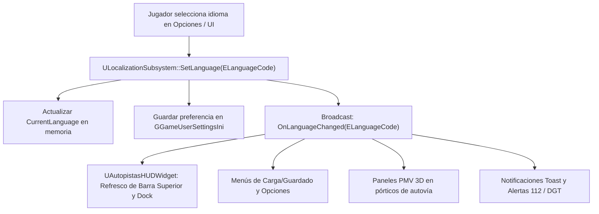

# 16 - Sistema de Localización Bilingüe en Tiempo Real (Español / Inglés)
## Proyecto "Autopistas de España: Simulador de Infraestructuras y Tráfico"
**Módulo:** Subsistema de Internacionalización y UI Bilingüe  
**Archivos C++ Principales:**  
- `Source/AutopistasEspana/Localization/LocalizationSubsystem.h`  
- `Source/AutopistasEspana/Localization/LocalizationSubsystem.cpp`  
**Idiomas Soportados:** Español (ES - Neutro Institucional DGT/MITMA) | Inglés (EN - Técnico Internacional AASHTO/UK Highway)  

---

## 1. Visión y Objetivos de la Localización

En **Autopistas de España**, la inmersión del jugador y la precisión técnica vial son prioritarias. El sistema de localización bilingüe ha sido diseñado bajo los siguientes pilares de producción AAA en Unreal Engine 5:

1. **Cambio Dinámico Instantáneo (*Hot-Swapping* sin reinicio):** El usuario puede conmutar entre Español e Inglés desde el Menú Principal, el Menú de Pausa o mediante comandos de consola sin necesidad de reiniciar la sesión de juego ni recargar el nivel.
2. **Propagación Reactiva por Delegados Multicast:** Al modificarse el idioma mediante `SetLanguage(ELanguageCode::Spanish / English)`, el subsistema dispara el delegado dinámico `OnLanguageChanged`. Todos los widgets UMG en pantalla, paneles de mensaje variable (PMV) 3D en la calzada y notificaciones Toast actualizan sus cadenas de forma sincronizada en el mismo fotograma.
3. **Terminología Técnica Oficial Española y su Equivalente Internacional:** Garantiza que términos de ingeniería civil española (Norma 3.1-IC del MITMA, biondas UNE-EN 1317, radares Pegasus de la DGT, pasos a nivel ADIF SLA, telepeaje Vía-T) dispongan de una traslación rigurosa, clara y comprensible tanto en español como en inglés.
4. **Persistencia Trans-Sesión Automatizada:** La preferencia lingüística seleccionada por el jugador se almacena en la configuración local del motor (`GGameUserSettingsIni`), manteniéndose intacta entre reinicios del ejecutable.
5. **Algoritmo de Resiliencia y Fallback Multinivel:** Ante cualquier clave no traducida en el idioma activo, el sistema aplica una cascada de respaldo (Idioma Activo $\rightarrow$ Español $\rightarrow$ Inglés $\rightarrow$ Clave Literal), impidiendo cuelgues o textos vacíos.



---

## 2. Arquitectura C++ del Subsistema

### 2.1. Clase Base y Ciclo de Vida
`ULocalizationSubsystem` hereda de `UGameInstanceSubsystem`. Esta decisión arquitectónica confiere ventajas críticas:
- **Persistencia entre Niveles:** El subsistema se crea con la inicialización del `UGameInstance` y permanece vivo a lo largo de todas las transiciones de mapas (Menú Principal $\leftrightarrow$ Partida en curso $\leftrightarrow$ Editor de Redes).
- **Acceso Global C++ y Blueprint:** Cualquier clase con acceso al contexto del mundo (`UWorld`) puede obtener la instancia activa mediante el método estático unificado:

```cpp
ULocalizationSubsystem* LocSubsystem = ULocalizationSubsystem::Get(WorldContextObject);
```

### 2.2. Enumeraciones y Tipos (`ELanguageCode`)

```cpp
UENUM(BlueprintType)
enum class ELanguageCode : uint8
{
    Spanish    UMETA(DisplayName = "Español (ES)"),
    English    UMETA(DisplayName = "English (EN)")
};

// Alias de retrocompatibilidad
using EGameLanguage = ELanguageCode;
```

### 2.3. Delegado Multicast Reactivo

```cpp
DECLARE_DYNAMIC_MULTICAST_DELEGATE_OneParam(FOnLanguageChangedDelegate, ELanguageCode, NewLanguage);

UPROPERTY(BlueprintAssignable, Category = "Localization")
FOnLanguageChangedDelegate OnLanguageChanged;
```

### 2.4. Matriz de Métodos Públicos de la API

| Método C++ | Firma Blueprint | Propósito |
| :--- | :--- | :--- |
| `SetLanguage(ELanguageCode NewLanguage)` | BlueprintCallable | Cambia el idioma activo, guarda en `GConfig` y dispara `OnLanguageChanged`. |
| `SetLanguageByCode(const FString& InLanguageCode)` | BlueprintCallable | Cambia el idioma mediante cadena ISO (`"ES"`, `"EN"`, `"es"`, `"en"`). |
| `GetLanguage()` / `GetCurrentLanguage()` | BlueprintPure | Devuelve la enumeración `ELanguageCode` activa. |
| `GetLanguageCodeString()` | BlueprintPure | Devuelve la cadena ISO (`"ES"` o `"EN"`). |
| `GetLanguageDisplayName()` | BlueprintPure | Devuelve el nombre amigable (`"Español (ES)"` o `"English (EN)"`). |
| `IsLanguage(ELanguageCode Language)` | BlueprintPure | Comprueba de forma booleana si un idioma específico está activo. |
| `GetLocalizedString(const FString& Key)` | BlueprintPure | Devuelve el `FText` traducido para la clave dada. |
| `GetLocalizedStringWithFallback(Key, Default)` | BlueprintPure | Consulta traducción devolviendo un valor por defecto si no existe la clave. |
| `GetLocalizedTextForLanguage(Key, TargetLang)` | BlueprintPure | Consulta una clave para un idioma determinado sin alterar el activo. |
| `GetFormattedLocalizedString(Key, Args)` | BlueprintCallable | Sustituye tokens nombrados `{Param}` dentro de la cadena traducida. |
| `GetFormattedLocalizedString1P(Key, Param0)` | BlueprintCallable | Sustituye el parámetro `{0}` de forma rápida y optimizada. |
| `GetFormattedLocalizedString2P(Key, P0, P1)` | BlueprintCallable | Sustituye los parámetros `{0}` y `{1}`. |
| `HasTranslationKey(const FString& Key)` | BlueprintPure | Comprueba la existencia de una clave en cualquiera de los diccionarios. |
| `GetTranslationCount(ELanguageCode Language)` | BlueprintPure | Devuelve el total de claves registradas para dicho idioma. |
| `GetAllTranslationKeys()` | BlueprintPure | Devuelve una lista con todas las claves maestras existentes. |
| `RegisterCustomString(Key, EsText, EnText)` | BlueprintCallable | Permite inyectar traducciones dinámicas en tiempo de ejecución (ej. mods). |
| `GetGameLocalizedString(Context, Key)` | BlueprintPure (Static)| Nodo puro estático para consultar traducciones desde cualquier Blueprint. |

---

## 3. Tablas Maestras de Cadenas de Texto (String Tables)

A continuación se detalla el diccionario completo integrado en el subsistema, estructurado por dominios temáticos de juego.

### 3.1. Menú Principal, Guardado y Navegación UI

| Clave (Key) | Texto en Español (ES) | Texto en Inglés (EN) | Contexto y Uso |
| :--- | :--- | :--- | :--- |
| `GAME_TITLE` | Autopistas de España | Highways of Spain | Cabecera y pantalla de inicio |
| `GAME_SUBTITLE` | Simulador de Infraestructuras y Tráfico | Infrastructure & Traffic Simulator | Subtítulo comercial |
| `MENU_PLAY` | Jugar | Play | Botón primario de inicio |
| `MENU_NEW_GAME` | Nueva Partida | New Game | Iniciar mapa en blanco o escenario |
| `MENU_CONTINUE` | Continuar | Continue | Reanudar última partida activa |
| `MENU_LOAD_GAME` | Cargar Partida | Load Game | Abrir navegador de ranuras de guardado |
| `MENU_SAVE_GAME` | Guardar | Save | Guardar en ranura actual |
| `MENU_SAVE_GAME_TITLE`| Guardar Partida | Save Game | Título del diálogo de guardado |
| `MENU_QUICK_SAVE` | Guardado Rápido (F5) | Quick Save (F5) | Atajo de teclado en HUD |
| `MENU_QUICK_LOAD` | Carga Rápida (F9) | Quick Load (F9) | Atajo de teclado en HUD |
| `MENU_AUTO_SAVE` | Autoguardado | Autosave | Indicador de guardado en segundo plano |
| `MENU_SETTINGS` | Opciones | Settings | Menú de ajustes generales |
| `MENU_OPTIONS` | Ajustes | Options | Pestañas de configuración |
| `MENU_QUIT` | Salir | Quit | Botón de cierre |
| `MENU_EXIT` | Salir al Escritorio | Exit to Desktop | Cierre completo del ejecutable |
| `MENU_BACK_MAIN` | Salir al Menú Principal | Exit to Main Menu | Retorno desde la partida |
| `MENU_RESUME` | Reanudar | Resume | Continuar tras pausa (ESC) |
| `MENU_PAUSE` | Pausa | Pause | Cabecera del menú de pausa |
| `SAVE_SLOT_EMPTY` | Ranura Vacía | Empty Slot | Ranura disponible sin datos |
| `SAVE_SLOT_NAME` | Ranura {0} | Slot {0} | Identificador dinámico de slot |
| `SAVE_SUCCESS` | Partida guardada correctamente en {0} | Game saved successfully to {0} | Notificación Toast de éxito |
| `LOAD_SUCCESS` | Partida cargada con éxito desde {0} | Game loaded successfully from {0} | Notificación Toast de carga |
| `SAVE_ERROR` | Error al guardar la partida en disco | Error saving game to storage | Alerta Toast de error |
| `LOAD_ERROR` | Error al cargar la partida seleccionada | Error loading selected save file | Alerta Toast de error |
| `CONFIRM_OVERWRITE` | ¿Desea sobrescribir la ranura de guardado seleccionada? | Do you want to overwrite the selected save slot? | Diálogo modal de confirmación |
| `CONFIRM_QUIT` | ¿Seguro que desea salir? Se perderán los progresos no guardados. | Are you sure you want to quit? Unsaved progress will be lost. | Diálogo modal de salida |
| `CONFIRM_YES` | Sí | Yes | Botón modal positivo |
| `CONFIRM_NO` | No | No | Botón modal negativo |
| `CONFIRM_CANCEL` | Cancelar | Cancel | Botón modal abortar |

---

### 3.2. Modos de Construcción e Infraestructura Vial

| Clave (Key) | Texto en Español (ES) | Texto en Inglés (EN) | Contexto y Uso |
| :--- | :--- | :--- | :--- |
| `TOOL_SELECT` | Inspeccionar / Cursor | Inspect / Cursor | Herramienta de selección de vía/vehículo |
| `BUILD_SINGLE_LANE` | Calzada única (90 km/h) | 1-Lane Road (90 km/h) | Carretera de calzada única / 1 carril |
| `TOOL_ROAD_1L` | Calzada única (90 km/h) | 1-Lane Road (90 km/h) | Dock inferior de construcción |
| `TOOL_ROAD_90` | Carretera Convencional (90 km/h) | Conventional Road (90 km/h) | Red Nacional 1+1 carriles con arcén |
| `BUILD_HIGHWAY_2X2` | Autovía 2x2 (120 km/h) | 2x2 Highway (120 km/h) | Doble calzada separada por mediana |
| `TOOL_HIGHWAY_2X2` | Autovía 2x2 (120 km/h) | 2x2 Highway (120 km/h) | Botón de herramienta en Dock |
| `BUILD_HIGHWAY_3X3` | Autopista 3x3 (120 km/h) | 3x3 Highway (120 km/h) | Gran capacidad para accesos metropolitanos |
| `TOOL_HIGHWAY_3X3` | Autopista 3x3 (120 km/h) | 3x3 Highway (120 km/h) | Botón de herramienta en Dock |
| `BUILD_ROUNDABOUT` | Enlace / Glorieta | Roundabout | Intersección circular giratoria |
| `TOOL_ROUNDABOUT` | Enlace / Glorieta | Roundabout | Botón de herramienta en Dock |
| `BUILD_BRIDGE` | Puente | Bridge | Estructura elevada sobre terreno |
| `TOOL_BRIDGE` | Puente / Viaducto | Bridge / Viaduct | Botón de herramienta en Dock |
| `TOOL_VIADUCT` | Viaducto / Puente | Viaduct / Bridge | Denominación en ingeniería civil |
| `BUILD_TUNNEL` | Túnel | Tunnel | Perforación bajo orografía |
| `TOOL_TUNNEL` | Túnel de Montaña | Mountain Tunnel | Botón de herramienta en Dock |
| `BUILD_TOLL` | Peaje | Toll | Estación de cobro por uso |
| `TOOL_TOLL` | Peaje (Vía-T / Manual) | Toll Plaza (Electronic / Manual) | Cabinas de peaje en tronco |
| `BUILD_LEVEL_CROSSING`| Paso a Nivel | Level Crossing | Intersección carretera-ferrocarril |
| `TOOL_LEVEL_CROSSING` | Paso a Nivel (ADIF PN Clase C) | Level Crossing (ADIF Class C) | Barreras SLA automáticas |
| `TOOL_RAILWAY_TRACK` | Vía Férrea (Ancho Ibérico) | Railway Track (Iberian Gauge) | Vía para convoyes de mercancías/AVE |
| `TOOL_BUS_LINES` | Líneas de Transporte | Transit Lines | Editor de concesiones de autobuses |
| `TOOL_DGT_CONTROLS` | Operativo DGT / Conos | DGT Police Checkpoint | Despliegue de patrullas y balizamiento |
| `TOOL_PEGASUS` | Patrulla Aérea Pegasus | Pegasus Helicopter Patrol | Vigilancia cenital por helicóptero |
| `TOOL_DEMOLISH` | Demolición / Excavadora | Demolition / Bulldozer | Eliminación y desmantelamiento de tramos |
| `BUILD_COST_PREVIEW` | Coste estimado: {0} € | Estimated cost: €{0} | Previsualización dinámica de presupuesto |
| `BUILD_LENGTH_PREVIEW`| Longitud: {0} m | Length: {0} m | Cota métrica del trazado de spline |
| `BUILD_SLOPE_TOO_STEEP`| Pendiente excesiva (> 8%): Requiere viaducto o túnel | Slope too steep (> 8%): Requires viaduct or tunnel | Error de geometría vial (Norma 3.1-IC) |
| `BUILD_BLOCKED` | Trazado obstruido por terreno o edificación | Route obstructed by terrain or structure | Conflicto de colisión de construcción |
| `BUILD_CONFIRM` | Construir tramo | Construct segment | Acción de confirmación con ratón |
| `BUILD_CANCEL` | Cancelar trazado | Cancel route | Cancelar acción actual |

---

### 3.3. Mecánicas Conmutables (Ajustes y Parámetros)

| Clave (Key) | Texto en Español (ES) | Texto en Inglés (EN) | Contexto y Uso |
| :--- | :--- | :--- | :--- |
| `SETTING_ROADWORKS_TITLE` | Impacto de Obras | Roadworks Impact | Título de la mecánica en Ajustes |
| `SETTING_ROADWORKS_ENABLED` | Impacto de Obras: Activado | Roadworks Impact: Enabled | Estado activo del conmutador |
| `SETTING_ROADWORKS_DISABLED`| Impacto de Obras: Desactivado | Roadworks Impact: Disabled | Estado inactivo del conmutador |
| `SETTING_ROADWORKS_DESC` | Al activarse, las obras requieren fases de maquinaria, cortan carriles con conos y reducen la velocidad del tráfico. | When enabled, construction requires machinery phases, closes lanes with cones, and reduces traffic speed. | Descripción explicativa al pasar cursor |
| `SETTING_ROAD_RAGE_TITLE` | Furia y Psicología Vial | Road Rage & Driver Psychology | Título de la mecánica de estrés |
| `SETTING_ROAD_RAGE_ENABLED` | Furia y Psicología Vial: Activada | Road Rage & Driver Psychology: Enabled | Estado activo del conmutador |
| `SETTING_ROAD_RAGE_DISABLED`| Furia y Psicología Vial: Desactivada | Road Rage & Driver Psychology: Disabled | Estado inactivo del conmutador |
| `SETTING_ROAD_RAGE_DESC` | Al activarse, las retenciones generan frustración en los conductores, bocinazos y maniobras temerarias. | When enabled, traffic delays cause driver frustration, horn honking, and reckless overtaking maneuvers. | Descripción de impacto en IA |
| `SETTING_WEATHER_TITLE` | Temporal y Dinámica Climática | Severe Storms & Weather Dynamics | Título del subsistema meteorológico |
| `SETTING_WEATHER_ENABLED` | Meteorología Dinámica: Activada | Dynamic Weather: Enabled | Conmutador de DANA / Nieve / Niebla |
| `SETTING_WEATHER_DISABLED` | Meteorología Dinámica: Desactivada | Dynamic Weather: Disabled | Desactivación para juego libre |
| `SETTING_LANGUAGE_TITLE` | Idioma / Language | Language / Idioma | Selector de localización en Opciones |
| `SETTING_GRAPHICS_QUALITY` | Calidad Gráfica | Graphics Quality | Ajustes de renderizado |

---

### 3.4. Alertas DGT, Estado de Calzada y Paneles PMV

| Clave (Key) | Texto en Español (ES) | Texto en Inglés (EN) | Contexto y Uso |
| :--- | :--- | :--- | :--- |
| `ALERT_PEGASUS_PATROL` | Patrulla Pegasus en servicio | DGT Pegasus on patrol | Alerta Toast: despliegue de helicóptero |
| `ALERT_PEGASUS_PATROL_DESC`| Helicóptero Pegasus de la DGT vigilando el corredor: cinemómetro radar activo contra excesos de velocidad. | DGT Pegasus helicopter patrolling highway: radar active tracking speeding and safety violations. | Detalle de la notificación aérea |
| `ALERT_ALCOHOL_CHECKPOINT` | Control preventivo de alcoholemia | Alcohol checkpoint | Alerta Toast: control de Guardia Civil |
| `ALERT_ALCOHOL_CHECKPOINT_DESC`| Guardia Civil de Tráfico desplegada en calzada con conos reflectantes y reducción a 1 carril. | Traffic Police deployed on carriageway with reflective cones and taper to 1 slow lane. | Detalle del embudo operativo |
| `ALERT_WEIGHT_CHECKPOINT` | Control de pesaje y tacógrafo | Weigh station checkpoint | Inspección de transporte pesado |
| `ALERT_TRAFFIC_JAM` | Tráfico denso / Retención | Traffic congestion | Alerta de retención en autovía |
| `ALERT_ROAD_JAM` | Tráfico denso / Retención: Vía colapsada, los conductores pierden los nervios. | Traffic congestion: Severe gridlock, drivers are getting frustrated. | Alerta vinculada a psicología vial |
| `ALERT_DANA_AQUAPLANING` | Temporal DANA / Aquaplaning | Severe storm / Aquaplaning | Alerta de emergencia meteorológica |
| `ALERT_WEATHER_RAIN` | Temporal DANA / Aquaplaning: Precipitación torrencial. Reduzca velocidad a 80 km/h. | Severe storm / Aquaplaning: Torrential rain on highway. Reduce speed to 80 km/h. | Alerta con instrucción de velocidad |
| `ALERT_WEATHER_SNOW` | Temporal de nieve: Firme deslizante | Snowstorm: Slippery road surface | Alerta de viabilidad invernal |
| `ALERT_WEATHER_FOG` | Niebla densa: Visibilidad reducida | Dense fog: Reduced visibility hazard | Alerta de tramos de visibilidad reducida |
| `ALERT_ACCIDENT` | ¡ALERTA 112: Accidente en calzada! Grúa y Guardia Civil en camino. | 112 EMERGENCY: Traffic collision! Tow truck and Highway Patrol dispatched. | Alerta Toast siniestro vial |
| `ALERT_ACCIDENT_EMERGENCY` | ¡ALERTA 112: Accidente grave en calzada! | 112 EMERGENCY: Severe highway crash! | Alerta crítica de colisión múltiple |
| `ALERT_LEVEL_CROSSING_DOWN`| Paso a Nivel cerrado: Tren aproximándose | Level Crossing closed: Approaching train | Aviso de bajada de semibarreras |
| `ALERT_ROADWORKS_ACTIVE` | Obras en calzada: Precaución maquinistas | Roadworks ahead: Heavy equipment caution | Aviso de tramo en conservación |
| `PMV_SPEED_LIMIT` | DGT: RESPETE LOS LIMITES DE VELOCIDAD | DGT: OBEY POSTED SPEED LIMITS | Panel Luminoso en Pórtico |
| `PMV_SEATBELT` | DGT: EL CINTURON SALVA VIDAS | DGT: SEATBELTS SAVE LIVES | Panel Luminoso en Pórtico |
| `PMV_FOG` | DGT: NIEBLA MODERE VELOCIDAD | DGT: FOG AHEAD SLOW DOWN | Panel Luminoso en Pórtico |
| `PMV_RAIN` | DGT: LLUVIA PELIGRO AQUAPLANING | DGT: RAIN AQUAPLANING HAZARD | Panel Luminoso en Pórtico |
| `PMV_JAM` | DGT: RETENCION PROXIMOS KILOMETROS | DGT: TRAFFIC JAM NEXT MILES | Panel Luminoso en Pórtico |

---

### 3.5. Presupuesto, Finanzas y Economía (€)

| Clave (Key) | Texto en Español (ES) | Texto en Inglés (EN) | Contexto y Uso |
| :--- | :--- | :--- | :--- |
| `ECONOMY_FUNDS_AVAILABLE` | € Fondos disponibles | € Available funds | Etiqueta de saldo en HUD |
| `ECONOMY_BALANCE` | Saldo en Tesorería | Treasury Balance | Desglose en panel de balance |
| `ECONOMY_DAILY_MAINTENANCE`| Mantenimiento diario | Daily maintenance | Gasto periódico en conservación |
| `ECONOMY_MONTHLY_MAINTENANCE`| Mantenimiento mensual de calzadas | Monthly road maintenance | Cuota de firme según kilómetros |
| `ECONOMY_TOLL_REVENUE` | Recaudación peajes | Toll revenue | Ingresos procedentes de telepeaje Vía-T |
| `ECONOMY_DGT_FINES` | Sanciones DGT | DGT traffic fines | Recaudación por radares y Pegasus |
| `ECONOMY_RAILWAY_CANON` | Cánones de autopista ferroviaria | Railway intermodal transit fees | Ingresos por camiones en trenes ADIF |
| `ECONOMY_NET_INCOME` | Balance neto | Net income | Balance periódico (Ingresos - Gastos) |
| `ECONOMY_BANKRUPT_WARNING` | ¡ALERTA: Fondos insuficientes para mantener la infraestructura! | WARNING: Insufficient funds to maintain infrastructure! | Alerta de quiebra de la concesionaria |
| `ECONOMY_COST_PER_METER` | Coste por metro lineal: {0} €/m | Cost per meter: €{0}/m | Cifra formateada al trazar spline |
| `ECONOMY_INSUFFICIENT_FUNDS`| Fondos insuficientes para realizar esta obra. | Insufficient funds for this construction work. | Rechazo de ejecución por falta de saldo |

---

### 3.6. HUD y Métricas de Simulación

| Clave (Key) | Texto en Español (ES) | Texto en Inglés (EN) | Contexto y Uso |
| :--- | :--- | :--- | :--- |
| `HUD_BUDGET` | Presupuesto | Budget | Barra superior de estado |
| `HUD_CONGESTION` | Congestión | Congestion | Indicador de % de retención global |
| `HUD_ACCIDENTS` | Accidentes Activos | Active Incidents | Contador de siniestros sin despejar |
| `HUD_ROAD_RAGE` | Furia al Volante | Road Rage | % medio de frustración de conductores |
| `HUD_SPEED` | Velocidad de Simulación | Simulation Speed | Selector de escala temporal |
| `HUD_SPEED_PAUSE` | Pausa (0x) | Pause (0x) | Detención del tiempo |
| `HUD_SPEED_1X` | Normal (1x) | Normal (1x) | Velocidad estándar de juego |
| `HUD_SPEED_2X` | Rápido (2x) | Fast (2x) | Aceleración temporal |
| `HUD_SPEED_4X` | Muy Rápido (4x) | Very Fast (4x) | Máxima compresión temporal |
| `HUD_WEATHER` | Meteorología | Weather | Widget meteorológico en esquina |
| `HUD_TIME` | Hora del Día | Time of Day | Reloj digital 24h |
| `HUD_TOTAL_KM` | Red viaria: {0} km | Road network: {0} km | Métrica de longitud de infraestructura |
| `HUD_VEHICLES_ACTIVE` | Vehículos: {0} | Vehicles: {0} | Censo de agentes IA activos |

---

### 3.7. Psicología Vial y Humor del Conductor

| Clave (Key) | Texto en Español (ES) | Texto en Inglés (EN) | Contexto y Uso |
| :--- | :--- | :--- | :--- |
| `DRIVER_MOOD_CALM` | Tranquilo | Calm | Estado normal de conducción |
| `DRIVER_MOOD_IMPATIENT` | Impaciente | Impatient | Ralentización leve del tráfico |
| `DRIVER_MOOD_IRRITATED` | Irritado | Irritated | Retención continuada > 2 minutos |
| `DRIVER_MOOD_ROAD_RAGE` | Furia al Volante | Road Rage | Colapso total con bocinazos y desvíos |
| `DRIVER_FRUSTRATION_INDEX` | Índice de Frustración: {0}% | Frustration Index: {0}% | Métrica del panel de inspección de vehículo |

---

### 3.8. Climatología y Entorno

| Clave (Key) | Texto en Español (ES) | Texto en Inglés (EN) | Contexto y Uso |
| :--- | :--- | :--- | :--- |
| `WEATHER_SUNNY` | Soleado / Despejado | Sunny / Clear | Adherencia $100\%$, visibilidad total |
| `WEATHER_OVERCAST` | Nublado | Overcast | Cielo cubierto |
| `WEATHER_RAIN_LIGHT` | Llovizna suave | Light Rain | Firme húmedo, reducción leve de agarre |
| `WEATHER_RAIN_TORRENTIAL` | Temporal DANA / Lluvia torrencial | Severe Storm / Torrential Rain | Formación de balsas y aquaplaning |
| `WEATHER_FOG` | Niebla densa | Dense Fog | Visibilidad $< 50\text{ m}$ |
| `WEATHER_SNOW` | Nevada intensa | Heavy Snow | Máquinas quitanieves y cadenas |

---

### 3.9. Ferrocarril y Pasos a Nivel

| Clave (Key) | Texto en Español (ES) | Texto en Inglés (EN) | Contexto y Uso |
| :--- | :--- | :--- | :--- |
| `RAILWAY_TRAIN_FREIGHT` | Autopista Ferroviaria (Mercancías) | Rolling Highway (Freight Train) | Convoy de plataformas para camiones |
| `RAILWAY_TRAIN_PASSENGER`| Tren de Cercanías | Commuter Passenger Train | Transporte masivo metropolitano |
| `RAILWAY_TRAIN_AVE` | Alta Velocidad (AVE) | High-Speed Rail (AVE) | Transporte de larga distancia |
| `RAILWAY_CROSSING_OPEN` | Paso a Nivel: Abierto al tráfico | Level Crossing: Open to traffic | Semibarreras alzadas |
| `RAILWAY_CROSSING_WARNING`| Paso a Nivel: Tren aproximándose | Level Crossing: Approaching train | Focos rojos parpadeantes y acústico |
| `RAILWAY_CROSSING_CLOSED` | Paso a Nivel: Cerrado (Barreras bajadas) | Level Crossing: Closed (Barriers lowered) | Calzada interceptada |

---

## 4. Guía de Integración Práctica para UI / UMG y C++

### 4.1. Suscripción Reactiva en Widgets UMG (`UUserWidget`)

Para garantizar que un widget en pantalla actualice sus textos instantáneamente cuando el jugador cambie de idioma en las opciones, se debe implementar el siguiente patrón en C++ o Blueprint:

```cpp
void UAutopistasHUDWidget::NativeConstruct()
{
    Super::NativeConstruct();

    if (ULocalizationSubsystem* LocSubsystem = ULocalizationSubsystem::Get(this))
    {
        // Suscribirse al delegado de cambio de idioma
        LocSubsystem->OnLanguageChanged.AddDynamic(this, &UAutopistasHUDWidget::HandleLanguageChanged);
        
        // Carga inicial de textos
        RefreshLocalizedTexts();
    }
}

void UAutopistasHUDWidget::HandleLanguageChanged(ELanguageCode NewLanguage)
{
    RefreshLocalizedTexts();
}

void UAutopistasHUDWidget::RefreshLocalizedTexts()
{
    if (ULocalizationSubsystem* LocSubsystem = ULocalizationSubsystem::Get(this))
    {
        TextBudgetLabel->SetText(LocSubsystem->GetLocalizedString(TEXT("HUD_BUDGET")));
        TextCongestionLabel->SetText(LocSubsystem->GetLocalizedString(TEXT("HUD_CONGESTION")));
        TextAccidentsLabel->SetText(LocSubsystem->GetLocalizedString(TEXT("HUD_ACCIDENTS")));
        TextRoadRageLabel->SetText(LocSubsystem->GetLocalizedString(TEXT("HUD_ROAD_RAGE")));
    }
}
```

### 4.2. Consulta Directa en Blueprint
Se proporciona el nodo estático `GetGameLocalizedString`:
- **Entrada:** `World Context Object` (automático), `Key` (String, ej. `"TOOL_HIGHWAY_2X2"`).
- **Salida:** `FText` traducido al idioma activo.

---

## 5. Guía de Estilo para Traductores (Localization Style Guide)

### 5.1. Reglas de Estilo para Español (ES)
- **Tono Institucional y Riguroso:** Las alertas deben redactarse con la solemnidad y precisión técnica de los comunicados de la **Dirección General de Tráfico (DGT)** y el **Centro de Gestión de Tráfico del 112**.
- **Vocabulario Oficial de Carreteras (Norma 3.1-IC):**
  - Utilizar siempre **"Calzada única"**, **"Autovía"**, **"Autopista"**, **"Glorieta"**, **"Arcén"**, **"Mediana"** y **"Bionda / Barrera de seguridad"**.
  - Evitar anglicismos innecesarios (usar *"retención"* o *"atasco"* en lugar de *"traffic jam"*, *"telepeaje Vía-T"* en lugar de *"fast pass"*).
- **Unidades Métricas:** La velocidad siempre se especifica en $\text{km/h}$ y las cotas de distancia en metros ($\text{m}$) o kilómetros ($\text{km}$). La moneda oficial es exclusivamente el Euro (€).

### 5.2. Reglas de Estilo para Inglés (EN)
- **Técnico-Accesible Internacional:** Vocabulario claro que resulte natural tanto a jugadores angloparlantes de Reino Unido como de Estados Unidos, priorizando términos estándar reconocidos internacionalmente:
  - *"Dual Carriageway / Highway"* para autovías 2x2.
  - *"Motorway / Highway"* para autopistas de alta capacidad 3x3.
  - *"Roundabout"* para glorietas.
  - *"Shoulder"* para arcén.
  - *"Level Crossing"* para pasos a nivel ADIF.
- **Formateo de Tokens de Parámetros:**
  - Los marcadores dinámicos `{0}`, `{1}` o nombrados como `{Length}` deben conservarse obligatoriamente en la traducción sin traducirse sus nombres internos, respetando el orden lógico gramatical en inglés.
  - Ejemplo: `"Coste estimado: {0} €"` $\rightarrow$ `"Estimated cost: €{0}"` (el símbolo € precede a la cifra en la convención inglesa).

---

## 6. Procedimiento para Incorporar Nuevas Cadenas al Proyecto

1. Abrir `Source/AutopistasEspana/Localization/LocalizationSubsystem.cpp`.
2. Localizar la sección temática correspondiente dentro del método `LoadDictionaries()`.
3. Añadir la pareja de cadenas para Español e Inglés:
   ```cpp
   SpanishDictionary.Add(TEXT("MI_NUEVA_CLAVE"), TEXT("Texto en español"));
   EnglishDictionary.Add(TEXT("MI_NUEVA_CLAVE"), TEXT("Text in English"));
   ```
4. Documentar la nueva clave en la tabla maestra de este documento (`16_SISTEMA_LOCALIZACION_BILINGUE_ES_EN.md`).
5. En la interfaz o actor de destino, invocar `LocSubsystem->GetLocalizedString(TEXT("MI_NUEVA_CLAVE"))`.

---
*Fin del Documento Técnico 16. Sistema de Localización Bilingüe en Tiempo Real de Autopistas de España.*
