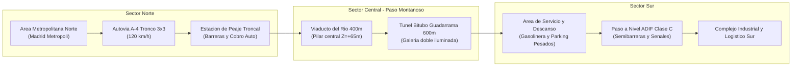

# 17 - Mundo Gigantesco, Geografía Española y Conectividad a Nivel de Carril
## Proyecto "Autopistas de España" (Unreal Engine 5)

Este documento técnico establece la arquitectura para el desarrollo exclusivo en **Unreal Engine 5** de un simulador de escala territorial masiva, fundamentado en:
1. **Un Mundo Abierto Gigantesco** gestionado mediante *World Partition* y coordenadas de 64 bits (*Large World Coordinates - LWC*).
2. **Orografía Ibérica Auténtica** con cordilleras montañosas escarpadas en el fondo del horizonte (Sistema Central, Despeñaperros, Picos de Europa, Pirineos y Meseta).
3. **Infraestructura Preexistente Viva**: la partida arranca con un corredor troncal ya operativo, ciudades funcionales y más de 40 vehículos circulando.
4. **Conectividad Vial a Nivel de Carril**: bifurcaciones, trenzados, cuñas de aceleración/deceleración según la Norma 8.1-IC, glorietas multicarril y pasos a distinto nivel (flyovers).
5. **Iconografía Técnica Vectorial Profesional**: erradicación total de emojis en beneficio de una interfaz gráfica de ingeniería de tráfico (CAD / GIS / SCADA DGT).

---

## 1. Escala Territorial y World Partition en Unreal Engine 5

Para evitar las limitaciones de los simuladores urbanos convencionales de mapa plano cerrado, el proyecto se asienta sobre la tecnología de mundo abierto de UE5:

```
+-----------------------------------------------------------------------+
|  CUADRICULA WORLD PARTITION: 16.0 km x 16.0 km (1.600.000 x 1.600.000 UU) |
|                                                                       |
|      [ CORDILLERA NORTE: CUMBRES GRANITICAS +2.400m ]                 |
|               /\/\/\/\/\/\/\/\/\/\/\/\/\/\/\                          |
|                                                                       |
|  [NUDO METROPOLITANO NORTE] ====== A-4 (3x3) ====== [PEAJE TRONCAL]   |
|            \\                                            ||           |
|             \\ Enlace Diamante                           ||           |
|              \\                                          ||           |
|         [VIADUCTO 400m] ------------------------ [TUNEL BITUBO 600m]  |
|          (Canon del Rio)                             (Paso Montana)   |
|                                                          ||           |
|  [LINEA FERREA ADIF] ===== Paso Nivel ===== A-4 (2x2) ===||           |
|                                                          ||           |
|  [COMPLEJO LOGISTICO SUR] ===============================//           |
|                                                                       |
|      [ SIERRA SUR / VALLE FLUVIAL EN EL HORIZONTE ]                   |
+-----------------------------------------------------------------------+
```

### 1.1. Especificaciones de Escala
- **Unidad de Medida Oficial:** $1\text{ Unreal Unit (UU)} = 1\text{ cm} = 0.01\text{ m}$.
- **Extensión del Mapa Inicial:** $16.0\text{ km} \times 16.0\text{ km}$ ($1.600.000\text{ UU} \times 1.600.000\text{ UU}$).
- **Capacidad de Expansión:** Compatible con particionado en celdas de $64\text{ km} \times 64\text{ km}$ gracias a Large World Coordinates (LWC double precision en UE5).
- **Streaming de Celdas:** Mallas del firme, viaductos y vehículos procesados en celdas activas de $1.200\text{ m}$, manteniendo el horizonte montañoso con mallas Nanite de baja frecuencia y niebla atmosférica volumétrica (*Lumen Atmosphere*).

---

## 2. Orografía y Fondos Montañosos de España

La vista panorámica del juego no presenta un horizonte vacío, sino las siluetas geográficas representativas de la Península Ibérica:

### 2.1. Regiones Geográficas Modeladas (`ESpanishGeographicRegion`):

1. **`SierraGuadarrama_SistemaCentral`**:
   - Granito erosionado, canchales y cumbres abruptas (Peñalara, Siete Picos) a cotas de $+2.200\text{ m}$ a $+2.420\text{ m}$ ($242.000\text{ UU}$).
   - Valles de pino silvestre en cotas medias y puertos estratégicos (Navacerrada, Guadarrama, Somosierra).
   - Pendientes de rasante de hasta el $6\%$ en autovías con carriles adicionales para vehículos lentos.

2. **`Despenaperros_SierraMorena`**:
   - Garganta fluvial de cuarcita armoricana con paredes verticales rojizas de $+300\text{ m}$ sobre el cauce del río Magaña.
   - Paso histórico de la Autovía del Sur (A-4) caracterizado por túneles gemelos consecutivos y viaductos en curva apoyados sobre pilares de más de $60\text{ metros}$ de altura libre.

3. **`PicosDeEuropa_Cantabrico`**:
   - Macizos calizos de roca blanca escarpada que superan los $+2.600\text{ m}$ a menos de $20\text{ km}$ de la línea costera.
   - Desfiladeros profundos (Hermida, Cares) y túneles de drenaje para nieblas persistentes.

4. **`Pirineos_ValleAran`**:
   - Orografía alpina glaciada con circos y picos escarpados. Pasos fronterizos internacionales con galerías antialudes y túneles transfronterizos (Somport, Vielha).

5. **`MesetaCentral_ValleTajo`**:
   - Llanura ondulada de cereal salpicada de cerros testigo, terrazas aluviales y cortes de cárcavas arcillosas.

---

## 3. Infraestructura Preexistente Viva al Iniciar Partida

El jugador no comienza en un lienzo en blanco; asume la gestión de una red viaria viva y funcional:



### 3.1. Elementos Integrados de Salida:
- **Corredor Troncal A-4 de 12 km:**
  - Tramo de acceso metropolitano con calzada de 3 carriles por sentido ($3\text{x}3$).
  - Transición fluida a autovía $2\text{x}2$ con mediana de hormigón New Jersey y bionda metálica galvanizada.
- **Viaducto de Vigas Artesa (400 m):**
  - Cruza una vaguada montañosa a cota $Z = +6.500\text{ UU}$ con tablero de hormigón pretensado y pilares de sección cajón.
- **Túnel Bitubo de Gran Sección (600 m):**
  - Dos tubos unidireccionales independientes excavados en roca, con hastiales de hormigón proyectado, iluminación cenital y ventilación forzada.
- **Estación de Peaje Troncal:**
  - 4 vías de telepeaje VIA-T y 2 vías de barrera manual con recaudación automática de $3.50\text{ Euros}$ por vehículo.
- **Área de Servicio y Descanso:**
  - Estación de combustible, cafetería de carretera y zona de estacionamiento vigilado para vehículos pesados según directiva europea.
- **Cruce Ferroviario ADIF:**
  - Vía férrea de ancho ibérico transversal con balasto, semibarreras abatibles y convoy de mercancías programado.
- **Tráfico Circulante Inicial:**
  - Censo inicial de 42 agentes de tráfico activos circulando y respondiendo a los límites de velocidad y a la orografía desde el instante cero.

---

## 4. Conectividad Vial Avanzada a Nivel de Carril

La ingeniería civil de autovías exige modelar cómo se fusionan, bifurcan y cruzan los carriles de forma independiente a la línea de eje:

### 4.1. Cuñas de Transición y Trenzados (Norma 8.1-IC):
- **Ramal de Incorporación (On-Ramp):**
  - Un carril de enlace ($3.50\text{ m}$) se aproxima tangencialmente a la calzada principal.
  - Genera una **cuña de aceleración** reglamentaria de $150\text{ m}$ a $200\text{ m}$ de longitud ($15.000$ a $20.000\text{ UU}$) con marcas viales de trazo discontinuo ancho ($40\text{ cm}$).
  - Los vehículos aplican el algoritmo MOBIL para buscar un hueco de inserción en el carril derecho de la autovía sin frenar en seco.
- **Ramal de Deceleración (Off-Ramp):**
  - Divergencia angular a $45^\circ$ respecto a la traza, precedida de una cuña de frenada de $120\text{ m}$.
- **Glorietas Multicarril de Gran Capacidad:**
  - Anillo circular con 2 carriles concéntricos ($4.00\text{ m}$ por carril) y diámetro exterior de $60\text{ m}$ a $90\text{ m}$.
  - Entradas de 2 carriles y salidas de 1 o 2 carriles con isletas deflectoras canalizadoras.
- **Pasos a Distinto Nivel (Flyovers / Enlaces en Diamante):**
  - Algoritmo de detección de gálibo vertical: Si dos ejes viales se cruzan en planta pero existe una diferencia vertical $\Delta Z \ge 550\text{ UU}$ ($5.50\text{ m}$ de gálibo oficial del MITMA), el sistema **no corta las carreteras ni genera intersección a nivel**; la vía superior se construye automáticamente como paso elevado sobre vigas de hormigón.

---

## 5. Sistema de Iconografía Técnica Vectorial (Cero Emojis)

Siguiendo las directrices de diseño corporativo técnico de la DGT, la interfaz descarta por completo los emoticonos y adopta una librería de 18 iconos vectoriales SVG limpios y geométricos:

| Identificador de Icono | Fichero SVG en `Content/Textures/UI/Icons/` | Descripción Técnica |
| :--- | :--- | :--- |
| **Cursor / Inspección** | `icon_cursor_inspect.svg` | Retícula pericial de telemetría y corchetes angulares de medición. |
| **Carretera Convencional** | `icon_road_convencional.svg` | Calzada única 90 km/h con eje discontinuo y flechas bidireccionales. |
| **Autovía 2x2** | `icon_autovia_2x2.svg` | Doble calzada simétrica con mediana rígida y bionda metálica. |
| **Autopista 3x3** | `icon_autovia_3x3.svg` | Sección de 6 carriles con distintivo de gran capacidad. |
| **Enlace / Ramal** | `icon_enlace_ramal.svg` | Bifurcación tangencial en curva con cuña de aceleración. |
| **Glorieta Giratoria** | `icon_rotonda_glorieta.svg` | Anillo anular multicarril con isleta central ajardinada y 4 accesos. |
| **Viaducto / Puente** | `icon_puente_viaducto.svg` | Tablero de puente apoyado en pilares de hormigón sobre valle. |
| **Túnel de Montaña** | `icon_tunel_montana.svg` | Sección en herradura con macizo rocoso superior y bóveda iluminada. |
| **Peaje Troncal** | `icon_peaje_troncal.svg` | Marquesina con cabinas, barrera abatible y tarjeta VIA-T. |
| **Paso a Nivel ADIF** | `icon_paso_nivel.svg` | Cruz de San Andrés oficial con foco luminoso rojo de parada. |
| **Grúa 112** | `icon_grua_112.svg` | Plataforma de auxilio con pluma hidráulica y rotativo ámbar. |
| **Guardia Civil Tráfico** | `icon_guardia_civil.svg` | Escudo heráldico con espada, fasces y corona de la Agrupación. |
| **Pegasus DGT** | `icon_helicoptero_pegasus.svg` | Helicóptero de vigilancia aérea con cámara giroscópica MX-15. |
| **Demoler / Obra** | `icon_demoler.svg` | Piqueta técnica y oruga de excavación de obra civil. |
| **Temporal DANA** | `icon_weather_dana.svg` | Frente isobárico con precipitación vectorial y coeficiente de fricción. |
| **Conductor Calmo** | `icon_driver_zen.svg` | Monitor de pulso cardíaco estable en cuadrante verde. |
| **Conductor Impaciente** | `icon_driver_impatient.svg` | Manómetro de presión media con sector ámbar. |
| **Furia al Volante** | `icon_driver_rage.svg` | Triángulo de sobrepresión crítica con indicador de riesgo extremo. |

---

## 6. Estado de Integración y Siguientes Pasos
Todos los componentes C++ para la orografía masiva y la conectividad a nivel de carril se encuentran coordinados en las ramas de desarrollo para compilación en Unreal Engine 5.8.
